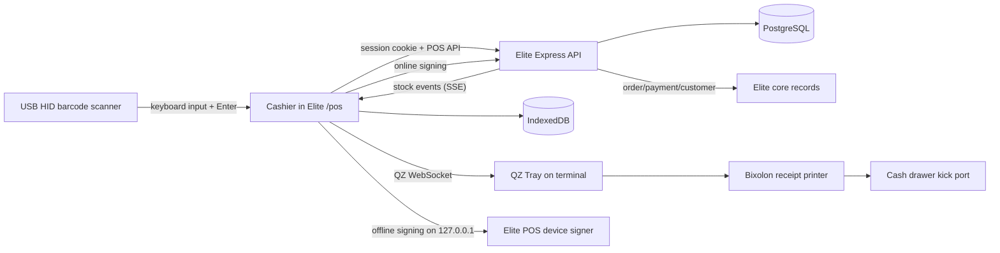

# Elite POS System and Integration Guide

> **Status:** Implemented baseline, with production hardware validation still required.  
> **Audience:** Developers, operators, administrators, deployment engineers, and support staff.  
> **Canonical implementation guide:** This document describes the code currently in the repository. The historical [POS implementation plan](./pos-integration-implementation-plan.md) and [POS system plan](./pos-system-plan.html) remain useful for design decisions and acceptance criteria.

## 1. Purpose

Elite POS is not a separate accounting system. It is a cashier interface and offline-capable transaction edge for Elite. A completed POS sale writes the same core Elite records used by the rest of the platform:

- An `orders` record and immutable `order_items`.
- A completed `payments` record.
- A `pos_transactions` record linked to the order, payment context, register, shift, cashier, and receipt.
- Inventory changes on `product_variants` and the parent product total.
- Customer history and LTV changes when a customer is linked.
- Audit entries for sensitive and operational actions.

The result is one source of truth. Products, stock, customers, sales, refunds, and reporting remain in Elite rather than being reconciled from an unrelated POS database later.

## 2. Current Capability

### Implemented

- Authenticated cashier UI at `/pos`.
- Register enrollment and persistent terminal credentials.
- One active shift per register.
- Server-reserved, tenant-wide receipt number blocks.
- Product search and USB HID barcode input.
- Cash and manually confirmed card checkout.
- Atomic order, payment, POS transaction, receipt, and stock creation.
- Local ESC/POS receipt rendering with QR/lookup data.
- QZ Tray printing and cash-drawer pulse support.
- IndexedDB catalog, shift, register, receipt block, hardware settings, parked carts, and offline sale queue.
- Offline checkout and automatic idempotent synchronization.
- Price and stock conflict capture for offline sales.
- Server-sent stock events between registers.
- Park and resume carts online or offline.
- Transaction lookup by transaction ID, idempotency key, sale/refund QR value, or receipt number.
- Same-shift voids with stock restoration.
- Full and partial refunds with optional restocking.
- Manager PIN approvals for refund, void, Z close, and conflict resolution.
- X-style current shift summary and immutable Z report close.
- Authenticated server-side QZ signing plus a loopback device signer for offline printing.
- Server integration tests and authenticated browser checkout E2E coverage.

### Not yet complete or intentionally deferred

- There is no dedicated low-privilege `cashier` role. POS access currently allows `owner`, `admin`, and `manager`.
- Card payment is manually confirmed by the cashier. No payment terminal or gateway authorization is performed by POS.
- Split tender, discounts, and POS tax calculation are not implemented.
- The checkout UI currently creates walk-in sales (`customerId: null`), although the customer-search API and backend linkage exist.
- Camera barcode scanning and barcode label printing are not implemented.
- Z reports are stored, but Z-report history UI and thermal printing are not implemented.
- The receipt renderer currently places the register UUID after an eight-character label on a 42-column line, which truncates the 36-character UUID. Print the label and UUID on separate lines before hardware acceptance.
- SSE replay detection currently needs an additional empty-buffer check: if retention removes every event for a tenant, a stale nonzero browser cursor is not classified as expired.
- Physical hardware behavior cannot be certified in software tests. The exact terminal, printer, drawer, scanner, browser, and QZ installation must pass the [hardware runbook](./pos-hardware-runbook.md).

## 3. System Architecture



### Trust boundaries

1. **User identity:** Elite's server-side authenticated session identifies the operator and tenant.
2. **Register identity:** A one-time enrollment creates a register credential. Check-in binds that register ID to the authenticated server session.
3. **Transaction authority:** The API derives tenant, cashier, and register from the session. The browser cannot choose another cashier or tenant in a sale payload.
4. **Database authority:** Online stock, price, receipt ownership, shift state, refund quantities, and totals are validated inside PostgreSQL transactions.
5. **Offline authority:** IndexedDB holds a temporary local queue and reserved receipt numbers. The server remains authoritative when those transactions synchronize.
6. **Hardware authority:** QZ Tray executes print commands, but signatures come from either the authenticated Elite API or a loopback-only signer with an explicit origin and printer allowlist.

## 4. Source Map

| Area | Main implementation |
|---|---|
| Cashier page | `client/projects/admin-portal/src/app/pages/pos/pos.component.*` |
| API client/types | `client/projects/admin-portal/src/app/services/pos.service.ts` |
| IndexedDB storage | `client/projects/admin-portal/src/app/services/pos-local-store.service.ts` |
| QZ integration | `client/projects/admin-portal/src/app/services/pos-hardware.service.ts` |
| Receipt renderer | `client/projects/admin-portal/src/app/services/pos-receipt-renderer.service.ts` |
| Offline app shell | `client/projects/admin-portal/src/pos-sw.js` |
| POS API router | `server/routes/pos.route.js` |
| Register lifecycle | `server/lib/pos/register-service.js` |
| Sale and catalog logic | `server/lib/pos/sale-service.js` |
| Offline synchronization | `server/lib/pos/sync-service.js` |
| Shifts and Z reports | `server/lib/pos/shift-service.js` |
| Manager approvals | `server/lib/pos/manager-service.js` |
| Refunds and voids | `server/lib/pos/correction-service.js` |
| Parked carts | `server/lib/pos/parked-cart-service.js` |
| Conflict handling | `server/lib/pos/conflict-service.js` |
| QZ signing | `server/lib/pos/qz-service.js` |
| Offline device signer | `tools/pos-device-signer/` |
| Database schema | `server/db/migrations/015_pos_foundation.sql` and `016_pos_operations.sql` |
| API integration test | `server/test/pos-authenticated-e2e.test.js` |
| Browser E2E | `client/e2e/pos-checkout.spec.ts` |

## 5. How POS Connects to Elite

### Catalog and inventory

The POS does not maintain a separate product catalog. It reads active Elite products and variants. Each sellable row includes:

- Product and variant IDs.
- Product name and variant description.
- SKU and barcode.
- Integer price in cents.
- Current variant stock.
- Primary product image.

Online sales lock the register and relevant variants, validate the current catalog price and stock, decrement variant stock, recompute parent product stock, and publish `stock.updated` events. Other connected registers receive those events through SSE and update their visible and cached stock.

### Orders and payments

A successful online sale is one database transaction. It creates and links:

1. `pos_receipts`
2. `orders`
3. `order_items`
4. `payments`
5. `pos_transactions`
6. `pos_transaction_items`

If any required write or validation fails, the transaction rolls back. Printing happens after commit, so a printer failure never reverses a completed financial sale.

Cash payments require:

- `cashAmountCents` equal to the sale total.
- `amountTenderedCents` greater than or equal to the sale total.
- `changeGivenCents` equal to tendered minus total.
- Card allocation equal to zero.

Card payments require:

- `cardAmountCents` equal to the sale total.
- All cash tender fields equal to zero.
- Cashier confirmation that an external/manual card payment succeeded.

### Customers and CRM

The backend accepts an optional Elite `customerId`. When present, the POS order appears in the same customer history and affects LTV. Refunds reduce LTV and voids remove the sale's LTV effect. The current cashier screen submits walk-in sales; wiring the existing customer search endpoint into checkout is a contained future UI change.

### Refunds and voids

- A **void** cancels a completed sale from its original open shift, restores stock, marks the order/payment appropriately, and records a durable `pos_voids` row. It is restricted to the original register and cashier.
- A **refund** can occur after the sale, supports selected lines and quantities, prevents over-refunding, optionally restores inventory, creates `pos_refunds`, `pos_refund_items`, and `payment_refunds`, and updates order/payment status.
- Both operations are idempotent and audited.
- Refund receipts contain cashier, register, item/SKU, amount, method, reason, receipt number, and QR lookup data.

### Reporting

The current shift summary calculates:

- Opening float.
- Gross, cash, and card sales.
- Refund and void totals.
- Net sales.
- Expected drawer cash.
- Transaction, refund, and void counts.

Closing a shift requires a physical cash count and manager approval. The immutable Z report stores expected cash, physical cash, and generated variance. A shift cannot close while local sales are pending or rejected.

## 6. Authentication, Enrollment, and Roles

### Authentication

All `/api/pos/*` routes use Elite's authenticated session cookie. The permitted roles are:

- `owner`
- `admin`
- `manager`

The route is also protected in the Angular router. Session-cookie and CORS settings must allow the admin origin to send credentials to the API.

### Register enrollment

Enrollment is a one-time action per browser profile/physical register:

1. An owner or admin creates a one-time token for a named register.
2. The token expires after 15 minutes and can be consumed only once.
3. Enrollment creates a `pos_registers` row and returns a random register credential once.
4. The browser stores the register ID and credential in IndexedDB.
5. Later visits use those credentials to check in and bind the register to the user's session.

Owners and admins can enter a terminal name on the setup screen and create/consume the token in one flow. A manager must paste a token previously created by an owner or admin.

Clearing the browser profile removes the local credential. Treat that as a terminal re-enrollment event; disable/revoke the abandoned register record before issuing a new identity.

### Manager PIN

- PINs are 4 to 8 digits and stored only as bcrypt hashes.
- Any active owner/admin/manager with a configured PIN can approve a protected action.
- A successful check produces a single-use, action-scoped token valid for five minutes.
- Five failed checks lock that cashier/register combination for five minutes.
- Approval and failure events are audited.

Because there is no dedicated cashier role, the PIN is currently a knowledge-based second factor rather than separation from a lower-privilege account.

## 7. Receipt Numbers and Idempotency

Elite allocates receipt numbers in tenant-wide blocks of 100. Blocks cannot overlap and are tied to one register. The browser persists the current block and next number in IndexedDB.

This design permits offline checkout without duplicate receipt numbers:

1. While online, the register obtains a reserved block.
2. A sale atomically writes the queued transaction and advances the local receipt pointer.
3. On synchronization, the server verifies that the receipt belongs to that register's reserved block.
4. `UNIQUE (tenant_id, receipt_number)` prevents reuse.

Every sale, refund, void, and Z close carries an idempotency key. Repeating a request with the same key returns or respects the existing operation instead of duplicating it. The browser uses `crypto.randomUUID()`.

## 8. Online Checkout Flow

```mermaid
sequenceDiagram
    participant Cashier
    participant Browser
    participant API
    participant DB
    participant QZ

    Cashier->>Browser: Build cart and select payment
    Browser->>API: POST /api/pos/transactions
    API->>DB: Lock register, shift, receipt, and variants
    DB->>DB: Create receipt/order/items/payment/POS transaction
    DB->>DB: Decrement stock and append events/audit
    DB-->>API: Commit
    API-->>Browser: Canonical sale and receiptData
    Browser->>QZ: Signed ESC/POS receipt job
    QZ-->>Cashier: Print receipt; pulse drawer for cash
```

Important behavior:

- Price and stock are checked again on the server.
- Two registers cannot both complete an online sale for the last unit.
- The receipt number is committed locally only after an online sale succeeds.
- If the network fails during checkout, the browser falls back to the offline queue using the same idempotency key.
- If printing fails, the sale remains saved and can be reprinted.

## 9. Offline Checkout and Synchronization

### What must happen online first

Offline checkout is allowed only after the terminal has:

- Been enrolled.
- Checked in successfully.
- Opened a shift.
- Cached a catalog.
- Reserved unused receipt numbers.
- Loaded the POS app shell/assets at least once.

### Local persistence

IndexedDB database `elite-pos` stores:

- Register identity and credential.
- Open shift context.
- Current receipt block and next number.
- Cached catalog and cache timestamp.
- Hardware configuration.
- Pending/rejected sale queue.
- Offline parked carts.

The service worker caches same-origin POS navigation and static assets. It deliberately does not cache `/api/*` responses. Business data is controlled through IndexedDB, not a generic HTTP cache.

### Offline transaction flow

1. The cashier completes a cash or manually confirmed card sale.
2. The browser creates a UUID idempotency key and immutable sale/receipt snapshot.
3. One IndexedDB transaction writes the queued sale and advances the reserved receipt number.
4. Cached stock is reduced locally for operator feedback.
5. The receipt renders locally and can print through QZ Tray using the local signer.
6. When connectivity returns, the queue posts to `/api/pos/transactions/sync` in bounded batches.

### Synchronization outcomes

| Outcome | Meaning | Operator action |
|---|---|---|
| `accepted` | The financial sale was written without a catalog conflict | None |
| `acceptedWithConflicts` | The sale was financially accepted, but stock or price changed while offline | Manager reconciles the conflict |
| `rejected` | The server could not safely accept the payload, receipt, register, or shift context | Correct the issue and retry or escalate |

Offline sales are treated as completed financial facts. If stock is now insufficient or price changed, Elite preserves the tendered sale and creates `pos_sync_conflicts`; it does not silently discard money already accepted at the counter.

Retry uses exponential backoff up to 60 seconds. Queue items remain durable across refreshes and browser restarts. Shift close is blocked until pending and rejected counts are zero.

## 10. Live Register Synchronization

`GET /api/pos/events` opens an authenticated SSE stream. The server:

- Derives the register from the session.
- Replays events after browser-managed `Last-Event-ID`.
- Polls committed `pos_events` every second.
- Sends heartbeats every 30 seconds.
- Emits `catalog.refresh-required` if a reconnect cursor predates the retained replay buffer.
- Retains approximately two days of replay events, with pruning throttled to about once per hour per API process.

Production reverse proxies must disable buffering and permit long-lived responses for this route. At larger multi-register scale, replace polling with PostgreSQL notifications or Redis and move retention to a scheduled job.

## 11. POS API Reference

All paths below are under `/api/pos` and require an authenticated allowed role. Most operational endpoints require an active register bound to the session; enrollment and selected setup/search endpoints are the exceptions.

| Method | Path | Purpose |
|---|---|---|
| `POST` | `/registers/enrollment-tokens` | Create a 15-minute one-time token; owner/admin only |
| `POST` | `/registers/enroll` | Consume a token and create register identity |
| `POST` | `/registers/check-in` | Validate stored register credentials and bind the session |
| `GET` | `/registers/current` | Return active register and current shift |
| `POST` | `/registers/receipt-number-blocks` | Reserve the next 100 tenant receipt numbers |
| `PUT` | `/manager-pin` | Configure a manager PIN |
| `POST` | `/manager/verify-pin` | Create a scoped single-use manager override |
| `GET` | `/products/search` | Search active variants by name, SKU, or barcode |
| `GET` | `/products/barcode/:barcode` | Resolve one active barcode |
| `POST` | `/shifts/open` | Open the register's shift with an opening float |
| `GET` | `/shifts/current` | Return the current/X-style shift summary |
| `POST` | `/shifts/z-report` | Close shift and store immutable Z report |
| `POST` | `/transactions` | Complete one online sale |
| `POST` | `/transactions/sync` | Synchronize an offline transaction batch |
| `PUT` | `/sync-state` | Report local pending/rejected counts for shift-close enforcement |
| `GET` | `/transactions/:id` | Load a transaction and receipt data |
| `GET` | `/transactions/lookup/:lookup` | Resolve sale/refund QR, transaction/idempotency key, or receipt number |
| `POST` | `/transactions/:id/void` | Void an eligible same-shift transaction |
| `POST` | `/refunds` | Create a full or partial refund |
| `GET` | `/parked-carts` | List current cashier/register parked carts |
| `POST` | `/parked-carts` | Park a cart |
| `DELETE` | `/parked-carts/:id` | Consume/delete a parked cart |
| `GET` | `/sync-conflicts` | List open reconciliation conflicts |
| `POST` | `/sync-conflicts/:id/resolve` | Resolve a conflict with manager approval |
| `GET` | `/customers/search?q=` | Search minimal customer data by phone |
| `GET` | `/print/certificate` | Return public QZ signing certificate |
| `POST` | `/print/sign` | Validate and sign an approved QZ request |
| `GET` | `/events` | Open authenticated SSE stream |

### Sale request example

```json
{
  "idempotencyKey": "7a4ea62d-7c24-4f85-85ac-5ed4d4afd7b3",
  "receiptNumber": 101,
  "shiftId": "8c5d9216-05a7-4d5a-a65c-d94910976e55",
  "customerId": null,
  "items": [
    {
      "variantId": "8a0ceceb-4d5a-4790-a718-9387fd5cb97b",
      "quantity": 2,
      "unitPriceCents": 12500
    }
  ],
  "payment": {
    "method": "cash",
    "cashAmountCents": 25000,
    "cardAmountCents": 0,
    "amountTenderedCents": 30000,
    "changeGivenCents": 5000
  },
  "clientCreatedAt": "2026-06-24T10:00:00.000Z"
}
```

Monetary fields are always integer cents. Do not send decimal currency values to the API.

## 12. Database Model

### Identity and control

- `pos_register_enrollment_tokens`
- `pos_registers`
- `pos_receipt_sequences`
- `pos_receipt_number_blocks`
- `pos_receipts`
- `pos_shifts`
- `pos_manager_overrides`
- `pos_pin_failures`

### Financial operations

- `pos_transactions`
- `pos_transaction_items`
- `pos_voids`
- `pos_refunds`
- `pos_refund_items`
- `payment_refunds`
- `pos_z_reports`

### Offline and operations

- `pos_parked_carts`
- `pos_sync_states`
- `pos_sync_conflicts`
- `pos_events`

POS schema is introduced by migrations `015_pos_foundation.sql` and `016_pos_operations.sql`. `server/db/pos-schema.js` applies both during API database preparation. Production deployments should still run and verify migrations deliberately before exposing traffic; startup application is not a substitute for a reviewed deployment procedure.

## 13. Receipt and Lookup Contract

The API returns canonical structured `receiptData`; the Angular renderer converts it to ESC/POS locally. A sale receipt contains:

- Zero-padded receipt number.
- Date/time.
- Cashier name.
- Register name and ID. The known renderer truncation listed in Section 2 must be corrected before production acceptance.
- Product, variant, SKU, quantity, unit price, and line total.
- Subtotal, tax, and grand total.
- Payment method.
- Tendered cash and change for cash sales.
- QR and printed lookup value.

Refund receipts use the same line format with a `REFUND` header, refunded amount, reason, method, cashier/register identity, and refund lookup QR.

Supported lookup input includes:

- `elite-pos:<transactionId>`
- `elite-pos:<offline-idempotencyKey>`
- `elite-pos-refund:<refundId>`
- A bare transaction UUID/idempotency UUID
- `#00000101` or `00000101`

The QR command uses standard ESC/POS `GS ( k`. Always validate QR size, density, paper width, and scan reliability on the production printer.

## 14. Hardware Integration Summary

Elite uses QZ Tray instead of direct browser USB/TCP access:

1. The browser creates raw ESC/POS text/commands.
2. QZ Tray exposes installed printer queues to the browser over secure localhost WebSocket.
3. QZ asks for a certificate and signature before accepting privileged operations.
4. While online, the browser calls authenticated Elite endpoints for those values.
5. While offline, it falls back to `http://127.0.0.1:8182`, where the Elite device signer uses a per-register key.
6. QZ sends the job to the exact allowlisted printer.
7. For cash sales, an ESC/POS drawer pulse follows the receipt in the same job.

Hardware configuration is terminal-local and stored in IndexedDB:

- Exact QZ printer name.
- Local device signer URL.
- Drawer pin 2, pin 5, or disabled.

Follow [Elite POS Hardware Runbook](./pos-hardware-runbook.md) for provisioning, certificate handling, startup services, network ports, tests, and troubleshooting.

## 15. Local Development

### Prerequisites

- Node.js and npm.
- PostgreSQL reachable through `DATABASE_URL`.
- Dependencies installed in root, `server`, and `client`.

### Start POS

From the repository root, use two terminals:

```bash
npm run server
```

```bash
npm run admin
```

Open `http://localhost:4300/pos` and sign in with an owner/admin/manager account. The API defaults to `http://localhost:3000/api`.

For all applications together:

```bash
npm run dev
```

### First local session

1. Sign in.
2. Open `/pos`.
3. As owner/admin, enter a terminal name and select **Connect register**.
4. Enter opening cash and select **Open shift**.
5. Confirm products have active variants, prices, stock, and optional barcodes.
6. Complete a test cash transaction.

QZ Tray is optional for application development. Without it, the sale still saves and the UI reports that printing failed.

## 16. Production Configuration

### API environment

```dotenv
DATABASE_URL=postgresql://...
CORS_ORIGINS=https://admin.example.com
SESSION_SECRET=<long-random-secret>
SESSION_COOKIE_SECURE=true
SESSION_COOKIE_SAMESITE=lax

QZ_SIGNING_CERT_PATH=/run/secrets/qz/digital-certificate.txt
QZ_SIGNING_KEY_PATH=/run/secrets/qz/private-key.pem
POS_PRINTER_ALLOWLIST=BIXOLON SRP-350plusIII
```

Use `SESSION_COOKIE_SAMESITE=none` only when the admin and API are genuinely cross-site; secure cookies and HTTPS are then mandatory.

### Reverse proxy requirements

- Proxy `/api` to Express with the original host/protocol information.
- Disable proxy buffering for `/api/pos/events`.
- Use a long read timeout for SSE.
- Do not cache authenticated POS API responses.
- Serve the admin portal and service worker over HTTPS.
- Preserve `Set-Cookie`, `Cookie`, and CORS credential behavior.

### Secrets

- Never commit QZ private keys.
- The API key file must be readable only by the API service account.
- Each register's offline signer should have a separate key/certificate so one terminal can be revoked independently.
- Do not store signing keys in Angular, browser storage, or API responses.
- Back up PostgreSQL; do not treat IndexedDB as a system-of-record backup.

## 17. Tests and Verification

### Server tests

```bash
cd server
npm test
```

This includes validation/unit coverage and a database-backed authenticated POS integration flow when `DATABASE_URL` is available.

### Admin production build

```bash
cd client
npm run build:admin
```

### Authenticated browser checkout E2E

```bash
cd client
npm run test:e2e
```

The Playwright test prepares a disposable POS tenant, logs in, enrolls a register, opens a shift, completes an online sale, completes an offline sale, reconnects, and waits for the queue to synchronize.

### What automated tests do not prove

- QZ trust/certificate behavior on the production browser profile.
- Real ESC/POS output on the selected Bixolon firmware.
- Cash drawer pin/timing compatibility.
- Scanner suffix and keyboard-layout behavior.
- Windows startup recovery.
- Offline signer operation with the network physically disconnected.

Those are mandatory hardware acceptance tests.

## 18. Operations and Troubleshooting

### Daily opening

1. Start the terminal and confirm network status.
2. Confirm QZ Tray and the local signer are running.
3. Sign in and open `/pos`.
4. Confirm the expected register name.
5. Open the shift with counted drawer cash.
6. Confirm printer status and run a test receipt when required by store policy.

### Daily closing

1. Reconnect the terminal if offline.
2. Confirm queue count is zero.
3. Resolve rejected sales and open sync conflicts.
4. Open shift summary.
5. Count physical cash.
6. Enter manager PIN and close the shift.
7. Record/escalate any variance according to store policy.

### Recovery rules

- **Printer failed:** Do not repeat the sale. Use **Print again** or transaction lookup/reprint.
- **Unknown whether sale saved:** Search by receipt/QR before retrying. Idempotency protects the original browser attempt, but operator verification prevents confusion.
- **Browser was cleared:** Stop using the old register identity, revoke it administratively/database-side, and enroll a new register.
- **Offline receipt block exhausted:** Reconnect and allocate another block; do not invent receipt numbers.
- **Rejected offline sale:** Preserve the queue item, inspect its error, and resolve the register/receipt/shift issue before retry.
- **Stock conflict:** The financial sale remains accepted. A manager records the reconciliation outcome.
- **Shift will not close:** Clear pending/rejected queue entries legitimately and resolve required approvals; never delete IndexedDB to bypass the close gate.

## 19. Monitoring and Audit

Recommended production monitoring:

- POS API error rate by code.
- Register check-in failures and disabled-register attempts.
- Pending/rejected sync counts and oldest queued age.
- Open sync conflicts and time to resolution.
- SSE connection count and poll/database latency.
- QZ signing rejection/rate-limit events.
- Printer/drawer failures reported by clients.
- Long-running open shifts.
- Z-report cash variance.
- Receipt block consumption and allocation rate.

Audit-sensitive actions include enrollment, receipt allocation, shift open/close, manager PIN updates/checks, sale/refund/void operations, conflict resolution, and signed drawer commands.

## 20. Rollout Checklist

### Staging

- [ ] Migrations `015` and `016` apply without changing unrelated Elite data.
- [ ] POS routes require authenticated allowed roles.
- [ ] Register enrollment, check-in, disable/revoke behavior is tested.
- [ ] Two-register receipt blocks do not overlap.
- [ ] Online concurrent last-unit sale behavior is tested.
- [ ] Offline sale survives refresh/restart and synchronizes once.
- [ ] Refund and void inventory/accounting behavior is verified.
- [ ] Shift close blocks pending/rejected queue state.
- [ ] SSE is not buffered by the proxy.
- [ ] Database backup and restore includes all POS tables.

### Hardware pilot

- [ ] Exact terminal/printer/drawer/scanner combination passes the hardware runbook.
- [ ] Online and offline signed printing work without warning dialogs.
- [ ] Cash receipt opens drawer; card receipt does not.
- [ ] Printed sale and refund QR codes resolve correctly.
- [ ] Restart restores QZ and signer automatically.
- [ ] Offline operation works after physically disconnecting Elite/network access.
- [ ] Operator and manager training is complete.

### Go-live

- [ ] Start with one register and one trained team.
- [ ] Monitor every shift, queue, conflict, and variance during the pilot.
- [ ] Keep a documented manual receipt/outage procedure.
- [ ] Add registers only after the first register completes stable online/offline shifts.
- [ ] Schedule event-retention maintenance before larger multi-register deployment.

## 21. Related Documentation

- [Elite POS Hardware Runbook](./pos-hardware-runbook.md)
- [POS Integration Implementation Plan](./pos-integration-implementation-plan.md)
- [POS System Plan and Acceptance Criteria](./pos-system-plan.html)
- [Admin Portal](./04-admin-portal.md)
- [API Server](./05-api-server.md)
- [Developer Guide](./07-dev-guide.md)
- [Database and API Implementation](./08-database-api-implementation.md)
- [Nginx and HTTPS](./09-nginx-https.md)
