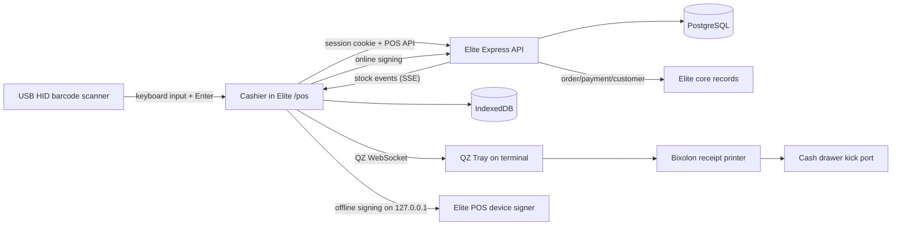

# Elite POS System and Integration Guide

> **Status:** Production-launch implementation for two shops with shared inventory; operational cutover checks still apply.
> **Audience:** Developers, operators, administrators, deployment engineers, and support staff.  
> **Canonical implementation guide:** This document describes the code currently in the repository. The historical [POS implementation plan](./pos-integration-implementation-plan.md) and [POS system plan](./pos-system-plan.html) remain useful for design decisions and acceptance criteria.

## 1. Purpose

Elite POS is not a separate accounting system. It is a cashier interface and offline-capable transaction edge for Elite. A completed POS sale writes the same core Elite records used by the rest of the platform:

- An `orders` record and immutable `order_items`.
- A completed `payments` record.
- A `pos_transactions` record linked to the order, payment context, register, shift, cashier, and receipt.
- Inventory changes on `product_variants` and the parent product total.
- Customer history and LTV changes when a customer is linked.
- Audit entries for sensitive and operational actions.

The result is one source of truth. Products, stock, customers, sales, refunds, and reporting remain in Elite rather than being reconciled from an unrelated POS database later.

## 2. Current Capability

### Implemented

- Authenticated cashier UI at `/pos`.
- Dedicated `cashier` role with POS access.
- Register enrollment and persistent terminal credentials.
- One active shift per register.
- Server-reserved, tenant-wide receipt number blocks.
- Product search and USB HID barcode input.
- Cash and manually confirmed card checkout.
- Atomic order, payment, POS transaction, receipt, and stock creation.
- Local ESC/POS receipt rendering with QR/lookup data.
- QZ Tray printing and cash-drawer pulse support.
- IndexedDB catalog, shift, register, receipt block, hardware settings, parked carts, and offline sale queue.
- Offline checkout and automatic idempotent synchronization.
- Price and stock conflict capture for offline sales.
- Server-sent stock events between registers.
- Park and resume carts online or offline.
- Transaction lookup by transaction ID, idempotency key, sale/refund QR value, or receipt number.
- Same-shift voids with stock restoration.
- Full and partial refunds with optional restocking.
- Manager PIN approvals for refund, void, Z close, and conflict resolution.
- X-style current shift summary and immutable Z report close.
- Authenticated server-side QZ signing plus a loopback device signer for offline printing.
- Automatic QZ reconnect, saved per-register hardware settings, and a Windows-startup installer with rotating signer logs.
- Morning recovery for an existing shift, a prior-day shift, or a shift opened by another cashier.
- Customer lookup/quick-create at checkout, with walk-in as the default.
- POS/client/server diagnostics correlated by request ID.
- Reason-coded inventory adjustments and blind/open stocktakes for owners/admins.
- Server integration tests and authenticated browser checkout E2E coverage.
- Keyboard shortcuts for the core sale flow (search, pay, park, customer lookup, new sale, cart-line selection) with always-visible key badges — see [Keyboard shortcuts](#keyboard-shortcuts) below.

### Not yet complete or intentionally deferred

- Card payment is manually confirmed by the cashier. No payment terminal or gateway authorization is performed by POS.
- Split tender and discounts are not implemented. **POS tax calculation was cut deliberately** — Qatar has no sales tax, so there is nothing to calculate (docs/25 Phase 6).
- Camera barcode scanning and barcode label printing are not implemented.
- SSE replay detection currently needs an additional empty-buffer check: if retention removes every event for a tenant, a stale nonzero browser cursor is not classified as expired.
- Physical hardware behavior cannot be certified in software tests. The exact terminal, printer, drawer, scanner, browser, and QZ installation must pass the [hardware runbook](./pos-hardware-runbook.md).

## 3. System Architecture


```mermaid
flowchart LR
    C["Cashier in Elite /pos"] -->|"session cookie + POS API"| A["Elite Express API"]
    A --> D[("PostgreSQL")]
    A -->|"order/payment/customer"| E["Elite core records"]
    A -->|"stock events (SSE)"| C
    C --> I[("IndexedDB")]
    C -->|"QZ WebSocket"| Q["QZ Tray on terminal"]
    Q --> P["Bixolon receipt printer"]
    P --> R["Cash drawer kick port"]
    C -->|"online signing"| A
    C -->|"offline signing on 127.0.0.1"| S["Elite POS device signer"]
    B["USB HID barcode scanner"] -->|"keyboard input + Enter"| C
```

### Trust boundaries

1. **User identity:** Elite's server-side authenticated session identifies the operator and tenant.
2. **Register identity:** A one-time enrollment creates a register credential. Check-in binds that register ID to the authenticated server session.
3. **Transaction authority:** The API derives tenant, cashier, and register from the session. The browser cannot choose another cashier or tenant in a sale payload.
4. **Database authority:** Online stock, price, receipt ownership, shift state, refund quantities, and totals are validated inside PostgreSQL transactions.
5. **Offline authority:** IndexedDB holds a temporary local queue and reserved receipt numbers. The server remains authoritative when those transactions synchronize.
6. **Hardware authority:** QZ Tray executes print commands, but signatures come from either the authenticated Elite API or a loopback-only signer with an explicit origin and printer allowlist.

## 4. Source Map

| Area | Main implementation |
|---|---|
| Cashier page | `client/projects/admin-portal/src/app/pages/pos/pos.component.*` |
| API client/types | `client/projects/admin-portal/src/app/services/pos.service.ts` |
| IndexedDB storage | `client/projects/admin-portal/src/app/services/pos-local-store.service.ts` |
| QZ integration | `client/projects/admin-portal/src/app/services/pos-hardware.service.ts` |
| Receipt renderer | `client/projects/admin-portal/src/app/services/pos-receipt-renderer.service.ts` |
| Offline app shell | `client/projects/admin-portal/src/pos-sw.js` |
| POS API router | `server/routes/pos.route.js` |
| Register lifecycle | `server/lib/pos/register-service.js` |
| Sale and catalog logic | `server/lib/pos/sale-service.js` |
| Offline synchronization | `server/lib/pos/sync-service.js` |
| Shifts and Z reports | `server/lib/pos/shift-service.js` |
| Manager approvals | `server/lib/pos/manager-service.js` |
| Refunds and voids | `server/lib/pos/correction-service.js` |
| Parked carts | `server/lib/pos/parked-cart-service.js` |
| Conflict handling | `server/lib/pos/conflict-service.js` |
| QZ signing | `server/lib/pos/qz-service.js` |
| Offline device signer | `tools/pos-device-signer/` |
| Database schema | `server/db/migrations/015_pos_foundation.sql` through `025_inventory_operations.sql` |
| Diagnostics | `server/routes/admin-diagnostics.route.js`, `server/routes/client-logs.route.js`, and admin `/diagnostics` |
| Inventory operations | `server/lib/inventory-ops-service.js` and admin `/stocktake` |
| API integration test | `server/test/pos-authenticated-e2e.test.js` |
| Browser E2E | `client/e2e/pos-checkout.spec.ts` |

## 5. How POS Connects to Elite

### Catalog and inventory

The POS does not maintain a separate product catalog. It reads Elite products and variants whose product status is not `archived` (variants must also have `is_active = true`). Each sellable row includes:

**Correction, 2026-08-18 — POS used to require `status = 'active'`, excluding hidden products.** `product.status` has three values: `active`, `hidden`, and `archived`. `hidden` means "not shown on the public storefront" (`server/routes/products.route.js` filters on it) — it says nothing about whether the item still exists to be sold in a shop. Before this fix, `server/lib/pos/sale-service.js`'s `searchProducts`, `listProductFilters`, `findByBarcode`, and `createSale`'s line-item check all required `status = 'active'`, so a product an admin marked "hidden" (e.g. a seasonal item pulled from the website but still on the shelf) silently disappeared from POS search, barcode scan, and even a same-second sale attempt with `VARIANT_INACTIVE` — while the admin catalog grid kept listing it (tagged "Hidden") the whole time, which read as "item vanished from the system." Fixed by relaxing all four checks to `status <> 'archived'`, matching the same "still in the catalog" definition `admin-products.route.js` already uses for its own listing. Only `archived` (true deletion) now excludes an item from POS; `hidden` only ever affects the storefront.

- Product and variant IDs.
- Product name and variant description.
- SKU and barcode.
- Integer price in cents.
- Current variant stock.
- Primary product image.

Online sales lock the register and relevant variants, validate the current catalog price and stock, decrement variant stock, recompute parent product stock, and publish `stock.updated` events. Other connected registers receive those events through SSE and update their visible and cached stock.

**Not POS-only (2026-08-18):** `stock.updated` events are published by every stock-writing path in the system, not just till sales — a paid web order, an admin manual adjustment, a posted stocktake, a catalog edit, and a CSV bulk import all call the same `publishStockEvent()` helper (`server/lib/inventory-ledger.js`, next to `recordMovement()`) in the same transaction as the stock write. A cashier's screen now reflects a sale made on the website, or a correction made in the admin catalog, within the usual ~1s poll — not only on the next catalog search. These writers use `register_id = NULL`, which the existing SSE filter (`register_id IS NULL OR register_id = ctx.registerId`) already broadcasts to every connected register in the tenant, so no server or frontend change was needed beyond adding the publish call itself.

### Shared inventory operating model

The two shops, stock room, and website deliberately share one tenant-wide inventory pool. A sale from either shop or the website decrements that same pool. Moving merchandise physically from the stock room to a shop, or between shops, does **not** change the shared total and is therefore not recorded as a sale, transfer, or stock adjustment. Registers and shifts remain separate for cashier and cash accountability.

This release answers “is the unit available anywhere in the business?”, not “which location currently holds it?”. Location-level availability and transfers are a future scope decision.

### Orders and payments

A successful online sale is one database transaction. It creates and links:

1. `pos_receipts`
2. `orders`
3. `order_items`
4. `payments`
5. `pos_transactions`
6. `pos_transaction_items`

If any required write or validation fails, the transaction rolls back. Printing happens after commit, so a printer failure never reverses a completed financial sale.

Cash payments require:

- `cashAmountCents` equal to the sale total.
- `amountTenderedCents` greater than or equal to the sale total.
- `changeGivenCents` equal to tendered minus total.
- Card allocation equal to zero.

Card payments require:

- `cardAmountCents` equal to the sale total.
- All cash tender fields equal to zero.
- Cashier confirmation that an external/manual card payment succeeded.

### Customers and CRM

The checkout can link an existing Elite customer or quick-create one while online; walk-in remains the default. Website and POS identity matching share normalized email/phone logic so the same person is not split by sales channel. Refunds reduce LTV and voids remove the sale's LTV effect. Offline quick-create is intentionally unavailable, while an already linked customer can travel with the queued sale.

### Refunds and voids

- A **void** cancels a completed sale from its original open shift, restores stock, marks the order/payment appropriately, and records a durable `pos_voids` row. It is restricted to the original register and cashier.
- A **refund** can occur after the sale, supports selected lines and quantities, prevents over-refunding, optionally restores inventory, creates `pos_refunds`, `pos_refund_items`, and `payment_refunds`, and updates order/payment status.
- Both operations are idempotent and audited.
- Refund receipts contain cashier, register, item/SKU, amount, method, reason, receipt number, and QR lookup data.
- **A card refund requires its own terminal reference** (`pos_refunds.terminal_reference`, migration 030), separate from the original sale's — the card terminal is standalone with no API link (docs/15 Phase 4), so refunding to a card is a second, distinct action on that terminal and needs its own proof of having happened. Enforced in `correction-service.js`'s `createRefund` the same way `sale-service.js` requires one for the original card sale; null for a cash refund, where there's nothing to reference.

### Reporting

The current shift summary calculates:

- Opening float.
- Gross, cash, and card sales.
- Refund and void totals.
- Net sales.
- Expected drawer cash.
- Transaction, refund, and void counts.

Closing a shift requires a physical cash count and manager approval. The immutable Z report stores expected cash, physical cash, and generated variance. A shift cannot close while local sales are pending or rejected.

## 6. Authentication, Enrollment, and Roles

### Authentication

All `/api/pos/*` routes use Elite's authenticated session cookie. The permitted roles are:

- `owner`
- `admin`
- `manager`
- `cashier`

The route is also protected in the Angular router. Session-cookie and CORS settings must allow the admin origin to send credentials to the API.

### Register enrollment

Enrollment is a one-time action per browser profile/physical register:

1. An owner or admin creates a one-time token for a named register.
2. The token expires after 15 minutes and can be consumed only once.
3. Enrollment creates a `pos_registers` row and returns a random register credential once.
4. The browser stores the register ID and credential in IndexedDB.
5. Later visits use those credentials to check in and bind the register to the user's session.

Owners and admins can enter a terminal name on the setup screen and create/consume the token in one flow. A manager must paste a token previously created by an owner or admin.

Clearing the browser profile removes the local credential. Treat that as a terminal re-enrollment event; disable/revoke the abandoned register record before issuing a new identity.

**Logging out does not un-enroll a register.** The identity lives in IndexedDB and survives logout; only the session's `posRegisterId` binding is lost, and `initialize()` re-binds it automatically by calling `/registers/check-in` with the stored credential after `/registers/current` answers `428`.

That recovery existed but was masked: the outer `catch` in `initialize()` sent *any* failure to the enrollment phase, so a slow catalog load or a stumble in hardware setup showed "paste a one-time token" on a counter that was perfectly enrolled — a dead end for a cashier, since issuing a token is owner-only. The phase is now chosen by cause: `resume-failed` (a retry screen that leaves the identity alone) when a stored identity exists, and `enrollment` only when there is no identity or the server actively disowned this register (`REGISTER_CREDENTIAL_INVALID`, `REGISTER_NOT_FOUND`, `REGISTER_DISABLED`).

### Manager PIN

- PINs are 4 to 8 digits and stored only as bcrypt hashes.
- Any active owner/admin/manager with a configured PIN can approve a protected action.
- A successful check produces a single-use, action-scoped token valid for five minutes.
- Ten failed checks lock that cashier/register combination for five minutes (raised from five — a known small shop with one till doesn't need a tight trigger, and five was tight enough to lock the register over ordinary typos).
- Approval and failure events are audited.

Cashiers cannot configure or provide a manager PIN. Protected actions require a different active owner/admin/manager; self-approval remains blocked.

When the operator enters their own correct PIN and `tenants.pos_emergency_self_approval_enabled` is off, the endpoint answers `403 SELF_APPROVAL_BLOCKED`, not `401 PIN_INVALID`. The attempt is audited as `pos.manager-pin.self-approval-blocked` and does not count toward the lockout, because the PIN was correct and the operator is already authenticated. A single-manager shop previously read this case as "Manager PIN is incorrect" and retyped a PIN that was right all along.

**No manager PIN configured anywhere.** If no active owner/admin/manager has ever set a PIN for the tenant, `verifyManagerPin` (`server/lib/pos/manager-service.js`) auto-approves instead of checking one — there is nothing to compare a typed PIN against, and treating that state as "incorrect" meant every attempt failed and could eventually lock the register over a setup gap, not a wrong guess. The override is recorded with `manager_id` set to the requesting cashier and audited as `pos.manager-pin.approved` with `autoApproved: true, reason: 'no_manager_pin_configured'`, so the trail still names exactly who did what even though no PIN was checked. `GET /pos/registers/current` returns `managerPinConfigured` so the client can skip showing the PIN field entirely (with an inline explanation in its place) instead of asking for one it already knows isn't needed — mirrors the `selfCloseAllowed` pattern used for shift close.

### Closing a shift

Closing a shift is the one protected action that does not need a second approver. `tenants.pos_self_close_shift_enabled` (migration 026, **on by default**) lets the cashier who opened the shift close it and print the Z report with no manager PIN. The Z report's `manager_id` is then that operator, and the audit entry carries `selfClose: true`.

The reasoning: closing a shift moves no money. It records the physical cash count against totals the server already computed, and that count is only meaningful when made by the person who actually held the drawer. Elite's shops run one branch manager under one owner, so demanding a *different* manager made the shift uncloseable whenever that manager was off-site. Void, refund, paid-out, safe-drop and no-sale drawer-open are untouched and still require a different approver.

`GET /pos/shifts/current` returns `selfCloseAllowed` so the close sheet knows whether to render the PIN field; `closeShift` re-derives the same answer server-side and never trusts the client's.

### The Approvals card

Settings → Devices & Security → Approvals holds both approval switches, backed by `GET`/`PUT /api/admin/pos-security/policy`. Reads are owner/admin; **writes are owner-only** and audited as `pos.policy.updated` with the changed fields. Either switch can be sent alone — the untouched column is `COALESCE`d to its stored value, so a partial request never resets the other setting.

| Switch | Column | Default | Effect |
|---|---|---|---|
| Let the person who opened the shift close it | `pos_self_close_shift_enabled` | on | Z report closes with no manager PIN, for that operator's own shift only |
| Let a manager approve with their own PIN | `pos_emergency_self_approval_enabled` | off | Lifts approver separation for refund, void, drawer-open and sync-conflict overrides, so the manager working the till approves with their own PIN |

The second switch is the one that matters for a one-person shop: with it off, `verifyManagerPin` skips the requesting user's own account and the override is rejected as `SELF_APPROVAL_BLOCKED`. With it on, the match is allowed and the approval is audited with `selfApproval: true`. It is off by default because it removes the second pair of eyes from the two actions that move money out of the drawer.

The PIN inputs in the POS carry `autocomplete="one-time-code"` and their Reason fields carry `autocomplete="off"`. Chrome ignores `autocomplete="off"` on password inputs, so without this the password manager filled the operator's account email into Reason and the saved login password into the PIN box, and every override failed with `PIN_INVALID`.

## 7. Receipt Numbers and Idempotency

Elite allocates receipt numbers in tenant-wide blocks of 100. Blocks cannot overlap and are tied to one register. The browser persists the current block and next number in IndexedDB.

This design permits offline checkout without duplicate receipt numbers:

1. While online, the register obtains a reserved block.
2. A sale atomically writes the queued transaction and advances the local receipt pointer.
3. On synchronization, the server verifies that the receipt belongs to that register's reserved block.
4. `UNIQUE (tenant_id, receipt_number)` prevents reuse.

Every sale, refund, void, and Z close carries an idempotency key. Repeating a request with the same key returns or respects the existing operation instead of duplicating it. The browser uses `crypto.randomUUID()`.

## 8. Online Checkout Flow

```mermaid
sequenceDiagram
    participant Cashier
    participant Browser
    participant API
    participant DB
    participant QZ

    Cashier->>Browser: Build cart and select payment
    Browser->>API: POST /api/pos/transactions
    API->>DB: Lock register, shift, receipt, and variants
    DB->>DB: Create receipt/order/items/payment/POS transaction
    DB->>DB: Decrement stock and append events/audit
    DB-->>API: Commit
    API-->>Browser: Canonical sale and receiptData
    Browser->>QZ: Signed ESC/POS receipt job
    QZ-->>Cashier: Print receipt; pulse drawer for cash
```

Important behavior:

- Price and stock are checked again on the server.
- Two registers cannot both complete an online sale for the last unit.
- The receipt number is committed locally only after an online sale succeeds.
- If the network fails during checkout, the browser falls back to the offline queue using the same idempotency key.
- If printing fails, the sale remains saved and can be reprinted.

## 9. Offline Checkout and Synchronization

### What must happen online first

Offline checkout is allowed only after the terminal has:

- Been enrolled.
- Checked in successfully.
- Opened a shift.
- Cached a catalog.
- Reserved unused receipt numbers.
- Loaded the POS app shell/assets at least once.

The catalog cache warns at 8 hours old and blocks offline checkout at 12 hours. A browser that reports Wi-Fi as connected but cannot reach the Elite API follows the same offline fallback; browser network status alone is not proof that the server is reachable.

### Local persistence

IndexedDB database `elite-pos` stores:

- Register identity and credential.
- Open shift context.
- Current receipt block and next number.
- Cached catalog and cache timestamp.
- Hardware configuration.
- Pending/rejected sale queue.
- Offline parked carts.

The service worker caches same-origin POS navigation and static assets. It deliberately does not cache `/api/*` responses. Business data is controlled through IndexedDB, not a generic HTTP cache.

### Offline transaction flow

1. The cashier completes a cash or manually confirmed card sale.
2. The browser creates a UUID idempotency key and immutable sale/receipt snapshot.
3. One IndexedDB transaction writes the queued sale and advances the reserved receipt number.
4. Cached stock is reduced locally for operator feedback.
5. The receipt renders locally and can print through QZ Tray using the local signer.
6. When connectivity returns, the queue posts to `/api/pos/transactions/sync` in bounded batches.

### Synchronization outcomes

| Outcome | Meaning | Operator action |
|---|---|---|
| `accepted` | The financial sale was written without a catalog conflict | None |
| `acceptedWithConflicts` | The sale was financially accepted, but stock or price changed while offline | Manager reconciles the conflict |
| `rejected` | The server could not safely accept the payload, receipt, register, or shift context | Correct the issue and retry or escalate |

Offline sales are treated as completed financial facts. If stock is now insufficient or price changed, Elite preserves the tendered sale and creates `pos_sync_conflicts`; it does not silently discard money already accepted at the counter.

Retry uses exponential backoff up to 60 seconds. Queue items remain durable across refreshes and browser restarts. Shift close is blocked until pending and rejected counts are zero.

## 10. Live Register Synchronization

`GET /api/pos/events` opens an authenticated SSE stream. The server:

- Derives the register from the session.
- Replays events after browser-managed `Last-Event-ID`.
- Polls committed `pos_events` every second.
- Sends heartbeats every 30 seconds.
- Emits `catalog.refresh-required` if a reconnect cursor predates the retained replay buffer.
- Retains approximately two days of replay events, with pruning throttled to about once per hour per API process.

Production reverse proxies must disable buffering and permit long-lived responses for this route. At larger multi-register scale, replace polling with PostgreSQL notifications or Redis and move retention to a scheduled job.

## 11. POS API Reference

All paths below are under `/api/pos` and require an authenticated allowed role. Most operational endpoints require an active register bound to the session; enrollment and selected setup/search endpoints are the exceptions.

| Method | Path | Purpose |
|---|---|---|
| `POST` | `/registers/enrollment-tokens` | Create a 15-minute one-time token; owner/admin only |
| `POST` | `/registers/enroll` | Consume a token and create register identity |
| `POST` | `/registers/check-in` | Validate stored register credentials and bind the session |
| `GET` | `/registers/current` | Return active register and current shift |
| `POST` | `/registers/receipt-number-blocks` | Reserve the next 100 tenant receipt numbers |
| `PUT` | `/manager-pin` | Configure a manager PIN |
| `POST` | `/manager/verify-pin` | Create a scoped single-use manager override |
| `GET` | `/products/search` | Search active variants by name, SKU, or barcode |
| `GET` | `/products/barcode/:barcode` | Resolve one active barcode |
| `POST` | `/shifts/open` | Open the register's shift with an opening float |
| `GET` | `/shifts/current` | Return the current/X-style shift summary |
| `POST` | `/shifts/z-report` | Close shift and store immutable Z report; manager override omitted on a self-close |
| `POST` | `/transactions` | Complete one online sale |
| `POST` | `/transactions/sync` | Synchronize an offline transaction batch |
| `PUT` | `/sync-state` | Report local pending/rejected counts for shift-close enforcement |
| `GET` | `/transactions/:id` | Load a transaction and receipt data |
| `GET` | `/transactions/lookup/:lookup` | Resolve sale/refund QR, transaction/idempotency key, or receipt number |
| `POST` | `/transactions/:id/void` | Void an eligible same-shift transaction |
| `POST` | `/refunds` | Create a full or partial refund |
| `GET` | `/parked-carts` | List current cashier/register parked carts |
| `POST` | `/parked-carts` | Park a cart |
| `DELETE` | `/parked-carts/:id` | Consume/delete a parked cart |
| `GET` | `/sync-conflicts` | List open reconciliation conflicts |
| `POST` | `/sync-conflicts/:id/resolve` | Resolve a conflict with manager approval |
| `GET` | `/customers/search?q=` | Find a customer by phone, name, or email. Digits match the normalized `phone_key` (migration 023), so "+974 5551 2345" and "97455512345" find the same person |
| `POST` | `/customers` | Quick-create at the till. **Online only.** Routed through the shared matcher (`server/lib/customer-identity.js`), so a phone that already belongs to a website customer links to that person instead of duplicating them; the response reports `linkedExisting` and `matchedOn` |
| `GET` | `/print/certificate` | Return public QZ signing certificate |
| `POST` | `/print/sign` | Validate and sign an approved QZ request |
| `GET` | `/events` | Open authenticated SSE stream |

### Sale request example

```json
{
  "idempotencyKey": "7a4ea62d-7c24-4f85-85ac-5ed4d4afd7b3",
  "receiptNumber": 101,
  "shiftId": "8c5d9216-05a7-4d5a-a65c-d94910976e55",
  "customerId": null,
  "items": [
    {
      "variantId": "8a0ceceb-4d5a-4790-a718-9387fd5cb97b",
      "quantity": 2,
      "unitPriceCents": 12500
    }
  ],
  "payment": {
    "method": "cash",
    "cashAmountCents": 25000,
    "cardAmountCents": 0,
    "amountTenderedCents": 30000,
    "changeGivenCents": 5000
  },
  "clientCreatedAt": "2026-06-24T10:00:00.000Z"
}
```

Monetary fields are always integer cents. Do not send decimal currency values to the API.

## 12. Database Model

### Identity and control

- `pos_register_enrollment_tokens`
- `pos_registers`
- `pos_receipt_sequences`
- `pos_receipt_number_blocks`
- `pos_receipts`
- `pos_shifts`
- `pos_manager_overrides`
- `pos_pin_failures`

### Financial operations

- `pos_transactions`
- `pos_transaction_items`
- `pos_voids`
- `pos_refunds`
- `pos_refund_items`
- `payment_refunds`
- `pos_z_reports`

### Offline and operations

- `pos_parked_carts`
- `pos_sync_states`
- `pos_sync_conflicts`
- `pos_events`

POS and launch-readiness schema is introduced by migrations `015` through `025`. `server/db/pos-schema.js` applies them in order under a PostgreSQL advisory lock during API startup. They are additive/idempotent, and the API refuses to start if database preparation fails. Production must back up first and verify migrations `022`–`025`; `npm run db:migrate` is the legacy initial-schema command, not the incremental runner.

## 13. Receipt and Lookup Contract

The API returns canonical structured `receiptData`; the Angular renderer converts it to ESC/POS locally. A sale receipt contains:

- Zero-padded receipt number.
- Date/time.
- Cashier name.
- Register name and full ID.
- Product name **in Arabic above English** on each item line (the receipt's only bilingual element — everything else is English, owner decision 2026-08-01). The Arabic name is snapshotted onto `pos_transaction_items.product_name_ar` at sale time, so a reprint shows what was sold rather than what the catalogue says today.
- Variant, quantity, unit price, and line total. A numeric-only variant is printed as `Size 15`, because a bare number under a product name could equally be a quantity or a style code. **The SKU is not printed** (owner decision, 2026-08-02): it is an internal catalogue reference, and the receipt number plus the QR already cover returns and lookup. `PosReceiptLine.sku` remains on the interface for the refund and exchange screens.
- Grand total. **No tax line:** Qatar has no sales tax (owner decision, 2026-08-01), so the receipt never prints one. Subtotal prints only when it differs from the total, which today it never does.
- Payment method.
- Tendered cash and change for cash sales.
- QR and printed lookup value.

Refund receipts use the same line format with a `REFUND` header, refunded amount, reason, method, cashier/register identity, and refund lookup QR.

Supported lookup input includes:

- `elite-pos:<transactionId>`
- `elite-pos:<offline-idempotencyKey>`
- `elite-pos-refund:<refundId>`
- A bare transaction UUID/idempotency UUID
- `#00000101` or `00000101`

The QR command uses standard ESC/POS `GS ( k`. Always validate QR size, density, paper width, and scan reliability on the production printer.

### 13.1 Printing rules the renderer has to obey

Three constraints come from the printer rather than from taste. All three were violated on the receipt printed 2026-08-02 and are fixed in `pos-receipt-renderer.service.ts`.

**There is no grey.** The canvas is sent to QZ with `quantization: 'luma'`, a hard threshold: every pixel is a black dot or bare paper. Grey does not print lighter, it prints *eroded*, because a glyph stem at 11-13px is roughly one antialiased pixel and tinting pushes its edges over the threshold. `#999` (luma 153) is above the threshold outright, so the QR caption, the SKU line and the CR number printed as nothing at all, silently. `#666` printed but shredded: `SCAN TO LOOK UP THIS SALE` came out as `SCAN TO _OGK UP TH S SALE`. De-emphasis is done with size and weight only. Small text also needs `500`-`600` weight so punctuation survives — a `15px` regular decimal point vanished, turning `QAR 1,220.00` into `QAR 1220 00`.

**The QR is not in the raster.** The body is a canvas image; the QR is drawn by the printer from `footerCommands()` afterwards. Two consequences. It obeys the *printer's* justification, which defaults to left, so it must be wrapped in `ESC a 1` / `ESC a 0` or it prints against the left edge while the rest of the receipt is centred. And no vertical space should be reserved for it in the canvas — a `y += 140` "reservation" positioned nothing and simply emitted a blank band about a third of the receipt tall.

**Module size 4 is too small to scan.** At 180dpi that is 0.56mm per module, roughly 12-14mm square for this payload. Size 8 gives 24-28mm, above the floor most phone cameras want, and still uses under half the 72mm printable width.

### 13.2 Branches

**Resolved 2026-08-03** — multiple physical shops, each with its own printable receipt identity. `pos_branches` (migration 027) holds one row per branch: name (internal label, never printed), trade name, address, phone, CR number, return policy, each EN/AR as applicable. `pos_registers.branch_id` assigns a register to exactly one branch; an unassigned register (`branch_id IS NULL`) falls back to the tenant's default branch (`pos_branches.is_default`, enforced unique per tenant by a partial index).

The header block below the wordmark (address, phone, CR number, return policy) is read from the calling register's effective branch — `server/lib/pos/branch-service.js`'s `getEffectiveBranchProfile()`, one query, no N+1: register's own branch → tenant default → oldest branch → `null`. `addressEn` is multi-line: entered line breaks are printed as written, and any line too wide for the tape is wrapped rather than clipped.

Managed from Settings → General (owner/admin only): add/edit/delete a branch, set the default, and assign each register to a branch from the Devices & Security registers table. A branch cannot be deleted while any register is still assigned to it, or if it is the tenant's only remaining branch — both return a 409 naming the reason. Deleting the current default promotes the next-oldest branch to default in the same transaction, so a tenant is never left without one.

The old single-profile table (`pos_business_profile`, one row per tenant) is superseded but left in place, untouched, as the migration's backfill source and a rollback path — not read or written by anything anymore. `footerStampEn`/`footerStampAr` exist as columns on `pos_branches` for schema parity but are not exposed in the API or UI; they've had no template field, no i18n key and no renderer usage since the original table (migration 017).

## 14. Hardware Integration Summary

Elite uses QZ Tray instead of direct browser USB/TCP access:

1. The browser creates raw ESC/POS text/commands.
2. QZ Tray exposes installed printer queues to the browser over secure localhost WebSocket.
3. QZ asks for a certificate and signature before accepting privileged operations.
4. While online, the browser calls authenticated Elite endpoints for those values.
5. While offline, it falls back to `http://127.0.0.1:8182`, where the Elite device signer uses a per-register key.
6. QZ sends the job to the exact allowlisted printer.
7. For cash sales, an ESC/POS drawer pulse follows the receipt in the same job.

Hardware configuration is terminal-local and stored in IndexedDB:

- Exact QZ printer name.
- Local device signer URL.
- Drawer pin 2, pin 5, or disabled.

### Touch sizing

Every register is a touchscreen, so the POS treats 44px (the accessibility floor for a fingertip) as a floor rather than a target. Controls a cashier hits repeatedly, at speed, standing, often one-handed while holding the product are sized past it: modal close 52px, colour pills and quantity steppers 56px, size tiles 118px.

Three rules apply to every button under `.pos-shell` rather than being repeated per component: `touch-action: manipulation` (drops the ~300ms the browser holds waiting for a double-tap-to-zoom, which reads as a laggy screen), `-webkit-tap-highlight-color: transparent` plus a deliberate `:active` scale (touch has no hover, so the press is the only chance to confirm the tap landed — without it cashiers tap twice), and `user-select: none` (repeated taps otherwise select the label and raise the text-selection handles mid-sale).

Spacing matters as much as size: adjacent colour pills are the easiest thing to mis-tap and a wrong colour is only caught at the receipt.

**A size tile never shows a colour name.** `sizeLabel()` must not fall back to `item.variant`, which the server builds as `color / size / material` joined — a variant with no size collapses to just its colour, which put a tile reading "Black" in a row with 5, 5.5 and 6. A sizeless variant reads "One size".

### Keyboard shortcuts

Every register is a touchscreen (see above), so shortcuts are a speed layer for staff who also have a keyboard at the counter — never a replacement for tapping. All of them live in `pos.component.ts`'s single `onGlobalKeydown()` `@HostListener`, active only while `phase() === 'selling'`.

| Key | Action |
|---|---|
| `F1` | Toggle the shortcuts help overlay |
| `F2` | Focus the search / barcode field |
| `F4` | Open payment (`beginPayment()`) |
| `F5` | Start a new sale — closes the receipt screen if one is showing, otherwise clears the cart (confirms first if it isn't empty) |
| `F6` | Focus the customer lookup field, opening payment first if it isn't already open |
| `F9` | Park the current sale |
| `F10` | Open the parked-sales list |
| `Enter` | Completes the sale, but only while the payment sheet is open — this is the one case allowed to fire from inside a text field (the tendered-amount input), matching how a physical cash register's Enter has always worked |
| `↑` / `↓` | Move the selected cart line (`selectedLineId`) |
| `Delete` | Remove the selected cart line |
| `Esc` | Close whichever is open: the help overlay, a dialog, or the payment sheet |

F-keys are used for the primary actions specifically because they can never collide with typed text or with the barcode scanner, which only ever sends digits followed by `Enter`. Everything else is gated behind `isTypingTarget()` so it never hijacks normal typing in a field.

Key badges (`<kbd class="key-badge">`) sit next to every button they correspond to and are always visible on desktop-width registers — not hidden behind a modifier key — so a new hire discovers them without being told. They're hidden below the 760px mobile breakpoint, where a physical keyboard is never present.

### Checking the running build

The POS service worker holds a new build back until checkout is idle, but nothing ever called `registration.update()`, so the browser only looked for one on navigation. A till left open all day could sit several deploys behind with nothing on screen saying so, which made "is the fix live on this register?" unanswerable during remote support.

POS tools → Hardware now ends with a **POS version** block showing the build this register is running against the build on the server, plus a **Check for updates** button. The two version strings come from the same source: `generate-pos-precache.mjs` stamps a content hash into `pos-sw.js` as `PRECACHE_VERSION` and writes the same value to `pos-precache.json`. The page asks the worker for its version over a `MessageChannel` (`GET_POS_VERSION`) and fetches the deployed one with `cache: 'no-store'`. `pos-precache.json` is deliberately neither precached nor matched by the worker's asset regex, so that request always reaches the server.

The button drives its own reload instead of relying on the passive `controllerchange` listener. That listener stands down when the page loaded without a controller — the first load after a worker is unregistered — which made the button show "the register will reload" and then do nothing. It also waits for an in-flight install to settle before reporting a result, since `registration.update()` resolves when the *check* finishes, not the download.

The button respects the same safety gate as an automatic update. With a cart, an open payment, or queued offline sales, it reports that the update is held back rather than reloading the page under the cashier's hands.

**Quantization must be `luma`, not `dither` and not the default.** Quantization decides which pixels become black dots. QZ's default, `alpha`, reads the alpha channel — and the receipt canvas is filled opaque white, so every pixel counts as ink and the whole receipt prints solid black. `dither` looks best on paper and is listed in the qz-tray JSDoc, but QZ Tray 2.2.6 has not implemented it and rejects the entire job with `Image quantization DITHER is not yet supported`. `luma` thresholds on luminance, which is what black-on-white text needs, and is supported.

That rejection is what broke printing, and it took three wrong guesses to find because of the error-truncation problem described below. `flavor` and the canvas width were both fine all along.

**The receipt image must be sent with `flavor: 'base64'`.** The body is a rasterized canvas (Arabic needs real text shaping, which ESC/POS text mode cannot do), and QZ's raw image path defaults `flavor` to a file path when it is omitted, so a canvas data URL fails with `Cannot parse (BASE64)iVBORw0KGgo...` and nothing prints. QZ wants the bare payload, so the `data:image/png;base64,` prefix `toDataURL()` produces is stripped at the QZ boundary; the renderer still returns a proper data URL.

**A failed print does not tear down the connection.** Paper-out, a malformed payload, or a job the driver refuses all surface with the websocket still open, so `printRendered` consults `qz.websocket.isActive()` before marking the register disconnected. Previously any print rejection scheduled a reconnect on top of an unrelated fault.

**An unreachable signer does not fail the hardware connection.** Because step 5 is a fallback for step 4, a register whose printer answers prints fine without the signer running; only offline printing is lost. `connectAndVerifyPrinter` therefore records the signer state and returns instead of throwing. It used to throw, which discarded a verified QZ websocket and re-ran the whole connect cycle every 30 seconds forever (a register was observed at attempt 45 with `printer check ok` logged on every pass, while `ERR_CONNECTION_REFUSED` on `127.0.0.1:8182` was the only real fault). While the signer is down, a 60-second poll watches for it to come back and stops as soon as it answers; a healthy register runs no timer.

`ready()` still requires the signer, since it drives the start-of-day readiness strip, and the open-shift warning now distinguishes the two cases: a printer that cannot be reached stops receipts now, a stopped signer only costs printing if the register later loses internet.

Reconnect failures are shipped to the durable client log for the first 3 consecutive attempts only (`MAX_DURABLE_RECONNECT_LOGS`). Console logging is unaffected, and the recovery record still carries the total attempt count. Before this cap, a printer left off overnight posted two `warn` records every 30 seconds.

Follow [Elite POS Hardware Runbook](./pos-hardware-runbook.md) for provisioning, certificate handling, startup services, network ports, tests, and troubleshooting.

## 15. Local Development

### Prerequisites

- Node.js and npm.
- PostgreSQL reachable through `DATABASE_URL`.
- Dependencies installed in root, `server`, and `client`.

### Start POS

From the repository root, use two terminals:

```bash
npm run server
```

```bash
npm run admin
```

Open `http://localhost:4300/pos` and sign in with an owner/admin/manager/cashier account. The API defaults to `http://localhost:3000/api`.

For all applications together:

```bash
npm run dev
```

### First local session

1. Sign in.
2. Open `/pos`.
3. As owner/admin, enter a terminal name and select **Connect register**.
4. Enter opening cash and select **Open shift**.
5. Confirm products have active variants, prices, stock, and optional barcodes.
6. Complete a test cash transaction.

QZ Tray is optional for application development. Without it, the sale still saves and the UI reports that printing failed.

## 16. Production Configuration

### API environment

```dotenv
DATABASE_URL=postgresql://...
CORS_ORIGINS=https://admin.example.com
SESSION_SECRET=<long-random-secret>
SESSION_COOKIE_SECURE=true
SESSION_COOKIE_SAMESITE=lax

QZ_SIGNING_CERT_PATH=/var/lib/elite-pos/qz/digital-certificate.txt
QZ_SIGNING_KEY_PATH=/var/lib/elite-pos/qz/private-key.pem
POS_PRINTER_ALLOWLIST=BIXOLON SRP-350plusIII
```

Use `SESSION_COOKIE_SAMESITE=none` only when the admin and API are genuinely cross-site; secure cookies and HTTPS are then mandatory.

### Reverse proxy requirements

- Proxy `/api` to Express with the original host/protocol information.
- Disable proxy buffering for `/api/pos/events`.
- Use a long read timeout for SSE.
- Do not cache authenticated POS API responses.
- Serve the admin portal and service worker over HTTPS.
- Preserve `Set-Cookie`, `Cookie`, and CORS credential behavior.

### Secrets

- Never commit QZ private keys.
- The API key file must be readable only by the API service account.
- Each register's offline signer should have a separate key/certificate so one terminal can be revoked independently.
- Do not store signing keys in Angular, browser storage, or API responses.
- Back up PostgreSQL; do not treat IndexedDB as a system-of-record backup.

## 17. Tests and Verification

### Server tests

```bash
cd server
npm test
```

This includes validation/unit coverage and a database-backed authenticated POS integration flow when `DATABASE_URL` is available.

### Admin production build

```bash
cd client
npm run build:admin
```

### Authenticated browser checkout E2E

```bash
cd client
npm run test:e2e
```

The Playwright test prepares a disposable POS tenant, logs in, enrolls a register, opens a shift, completes an online sale, completes an offline sale, reconnects, and waits for the queue to synchronize.

### What automated tests do not prove

- QZ trust/certificate behavior on the production browser profile.
- Real ESC/POS output on the selected Bixolon firmware.
- Cash drawer pin/timing compatibility.
- Scanner suffix and keyboard-layout behavior.
- Windows startup recovery.
- Offline signer operation with the network physically disconnected.

Those are mandatory hardware acceptance tests.

## 18. Operations and Troubleshooting

### Daily opening

1. Start the terminal, sign in, and open `/pos`; do not clear this browser profile or its site data.
2. The POS restores the saved register/hardware configuration and reconnects QZ automatically. Confirm the expected register and green hardware state; the Windows signer should already be running.
3. If there is no shift, count the drawer and open one. If yesterday's shift is still open, or another cashier owns it, follow the on-screen recovery/manager flow instead of opening a competing shift.
4. Confirm server reachability and queue count. Wi-Fi can be connected while the API is unreachable; in that case the POS uses its offline state and catalog-freshness rules.
5. Run a test receipt only when required by store policy.

### Daily closing

1. Reconnect the terminal if offline.
2. Confirm queue count is zero.
3. Resolve rejected sales and open sync conflicts.
4. Open shift summary.
5. Count physical cash.
6. Enter manager PIN and close the shift.
7. Record/escalate any variance according to store policy.

### Recovery rules

- **Printer failed:** Do not repeat the sale. Use **Print again** or transaction lookup/reprint.
- **Unknown whether sale saved:** Search by receipt/QR before retrying. Idempotency protects the original browser attempt, but operator verification prevents confusion.
- **Browser was cleared:** Stop using the old register identity, revoke it administratively/database-side, and enroll a new register.
- **Offline receipt block exhausted:** Reconnect and allocate another block; do not invent receipt numbers.
- **Rejected offline sale:** Preserve the queue item, inspect its error, and resolve the register/receipt/shift issue before retry.
- **Stock conflict:** The financial sale remains accepted. A manager records the reconciliation outcome.
- **Shift will not close:** Clear pending/rejected queue entries legitimately and resolve required approvals; never delete IndexedDB to bypass the close gate.
- **Hardware is red:** Wait for automatic reconnect, verify QZ Tray and `http://127.0.0.1:8182/health`, then use Hardware to retry discovery. Do not re-enroll the register.
- **Need to trace a problem:** Copy the request reference shown to the cashier. Owner/Admin can search it in `/diagnostics`; signer logs are at `C:\ProgramData\ElitePOS\device-signer\logs\signer.log`.

## 19. Monitoring and Audit

Recommended production monitoring:

- POS API error rate by code.
- Register check-in failures and disabled-register attempts.
- Pending/rejected sync counts and oldest queued age.
- Open sync conflicts and time to resolution.
- SSE connection count and poll/database latency.
- QZ signing rejection/rate-limit events.
- Printer/drawer failures reported by clients.
- Long-running open shifts.
- Z-report cash variance.
- Receipt block consumption and allocation rate.

Audit-sensitive actions include enrollment, receipt allocation, shift open/close, manager PIN updates/checks, sale/refund/void operations, conflict resolution, and signed drawer commands.

## 20. Rollout Checklist

### Staging

- [ ] Migrations `015`–`025` apply without changing unrelated Elite data; verify observability, customer link, Arabic item snapshot, inventory ledger, and stocktake schema.
- [ ] POS routes require authenticated allowed roles.
- [ ] Register enrollment, check-in, disable/revoke behavior is tested.
- [ ] Two-register receipt blocks do not overlap.
- [ ] Online concurrent last-unit sale behavior is tested.
- [ ] Offline sale survives refresh/restart and synchronizes once.
- [ ] Refund and void inventory/accounting behavior is verified.
- [ ] Shift close blocks pending/rejected queue state.
- [ ] SSE is not buffered by the proxy.
- [ ] Database backup and restore includes all POS tables.

### Hardware acceptance

- [ ] Exact terminal/printer/drawer/scanner combination passes the hardware runbook.
- [ ] Online and offline signed printing work without warning dialogs.
- [ ] Cash receipt opens drawer; card receipt does not.
- [ ] Printed sale and refund QR codes resolve correctly.
- [ ] Restart restores QZ and signer automatically.
- [ ] Offline operation works after physically disconnecting Elite/network access.
- [ ] Operator and manager training is complete.

### Go-live (two shops)

- [ ] Validate every production register and train both shop teams.
- [ ] Confirm both shops and the website decrement the shared pool; physical replenishment is not entered as a sale, transfer, or adjustment.
- [ ] Monitor every shift, queue, conflict, and variance during launch week.
- [ ] Keep a documented manual receipt/outage procedure.
- [ ] Add registers only after the first register completes stable online/offline shifts.
- [ ] Schedule event-retention maintenance before larger multi-register deployment.

## 21. Related Documentation

- [Elite POS Hardware Runbook](./pos-hardware-runbook.md)
- [POS Field Setup Runbook](./pos-field-setup-runbook.html) — interactive on-site checklist for wiring one register and cutting it over from swiftPOS
- [POS Integration Implementation Plan](./pos-integration-implementation-plan.md)
- [POS System Plan and Acceptance Criteria](./pos-system-plan.html)
- [Admin Portal](./04-admin-portal.md)
- [API Server](./05-api-server.md)
- [Developer Guide](./07-dev-guide.md)
- [Database and API Implementation](./08-database-api-implementation.md)
- [Nginx and HTTPS](./09-nginx-https.md)
