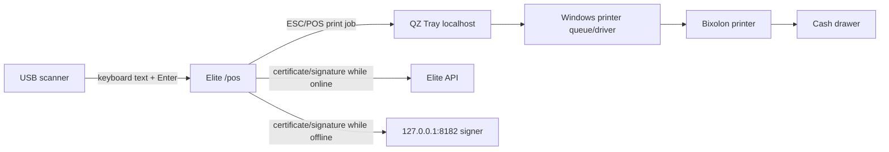

# Elite POS Hardware Integration Runbook

> **Purpose:** Provision and certify one physical Elite register using a Posiflex-class Windows terminal, QZ Tray, a Bixolon 80 mm ESC/POS printer, a printer-connected cash drawer, and a USB HID barcode scanner.  
> **Related:** Read [Elite POS System and Integration Guide](./12-pos-system.md) before using this runbook.

## 1. Supported Hardware Model

| Component | Expected integration |
|---|---|
| POS terminal | Windows terminal or PC running a supported Chromium browser |
| Receipt printer | Bixolon 80 mm ESC/POS printer installed as an OS printer queue |
| Cash drawer | Connected to the receipt printer's drawer kick port; never directly controlled by Elite |
| Barcode scanner | USB HID/keyboard-wedge scanner configured to append Enter |
| Print bridge | QZ Tray 2.2.x running locally |
| Offline signing | Elite POS device signer running on `127.0.0.1:8182` |

Do not assume two models with similar names have identical cutter, QR, code page, or drawer behavior. Certify the exact model and firmware used in production.

## 2. Data and Command Path



Elite does not send directly to printer port `9100` and does not use browser WebUSB. QZ Tray owns printer communication.

## 3. Network and Port Requirements

| Source | Destination | Port/protocol | Reason |
|---|---|---|---|
| Browser | Elite admin/API | `443/TCP` HTTPS | UI, session, API, SSE, online QZ signatures |
| Browser | QZ Tray | QZ secure localhost WebSocket, normally `8181` | Discover printers and submit jobs |
| Browser | Device signer | `127.0.0.1:8182/TCP` HTTP | Offline certificate and signature callbacks |
| QZ/Windows | Printer | USB, Windows spooler, or printer-specific network path | Physical print delivery |

Requirements:

- The device signer must bind only to `127.0.0.1`, not `0.0.0.0` or a LAN address.
- No inbound LAN firewall rule is required for port `8182`.
- Allow the Elite admin origin through Chrome Local Network Access prompts/policy.
- Permit long-lived HTTPS connections to `/api/pos/events`.
- If a network printer is used, reserve its IP and restrict printer access to the POS VLAN.

## 4. Required Files and Secrets

Prepare:

- QZ signing `digital-certificate.txt`.
- Matching RSA 2048-bit PKCS#8 private key.
- A server-side certificate/key available to the Elite API.
- A separate per-register certificate/key available only to that register's local signer.
- The exact printer queue name as returned by QZ Tray.
- The exact production Elite admin origin.

Obtain signing material through the approved QZ certificate process. Do not invent an unrelated browser certificate or reuse the Elite HTTPS certificate.

Private keys must never be:

- Added to Git.
- Bundled in Angular.
- Stored in IndexedDB/localStorage.
- Returned by an API endpoint.
- Shared over a common network folder.
- Reused across every physical register when per-register revocation is required.

## 5. Configure the Elite API Signer

Place the public certificate and private key in the deployment secret store or restricted filesystem. Configure `server/.env`:

```dotenv
QZ_SIGNING_CERT_PATH=/run/secrets/qz/digital-certificate.txt
QZ_SIGNING_KEY_PATH=/run/secrets/qz/private-key.pem
POS_PRINTER_ALLOWLIST=BIXOLON SRP-350plusIII
```

For multiple approved queues, use comma-separated exact names:

```dotenv
POS_PRINTER_ALLOWLIST=BIXOLON SRP-350plusIII,BIXOLON SRP-350plusIII Counter 2
```

Restart the API and verify:

- An authenticated, enrolled POS session can call `GET /api/pos/print/certificate`.
- `POST /api/pos/print/sign` signs approved QZ operations.
- A print request naming a non-allowlisted printer is rejected.
- Unsupported operations such as file writes are rejected.

The signer limits request size, allows only QZ WebSocket/version/printer discovery/print calls, checks printer names, rate-limits each register, and audits signed drawer commands.

## 6. Install and Configure the Printer

1. Connect the Bixolon printer by the deployment-approved USB or network method.
2. Install the vendor-supported Windows driver.
3. Create a stable printer queue name. Avoid names that Windows may automatically rename after reconnecting USB ports.
4. Set the correct 80 mm paper width.
5. Disable driver transformations that convert raw ESC/POS to a graphic document when the driver offers raw/pass-through mode.
6. Print the Windows test page only to verify transport; it does not validate ESC/POS.
7. Record printer model, serial number, firmware, connection type, queue name, and assigned register.

The queue name must exactly match `POS_PRINTER_ALLOWLIST`, the local signer allowlist, and the value entered in Elite's Hardware dialog.

## 7. Connect the Cash Drawer

1. Power off the printer.
2. Connect the drawer cable to the printer's drawer kick port.
3. Confirm the cable pinout and voltage are approved by both printer and drawer vendors.
4. Power on the printer.
5. Start with **Pin 2** in Elite hardware settings.
6. If the drawer does not open and the hardware manual specifies the alternate output, test **Pin 5**.
7. Choose **Disabled** if no drawer is attached.

Elite sends an ESC/POS `ESC p` pulse only for cash receipt printing. Card receipt printing must not pulse the drawer. A manual open should be treated as a controlled manager action; the current UI primarily opens the drawer through cash checkout.

Never connect the drawer directly to a general computer port or improvise voltage/pin mappings.

## 8. Configure the Barcode Scanner

1. Connect the scanner by USB.
2. Configure it as HID keyboard/keyboard wedge.
3. Set the scanner suffix to Enter/Carriage Return.
4. Select a keyboard layout that matches the Windows user session.
5. Disable scanner-added prefixes unless Elite product barcodes include them.
6. Ensure Elite `product_variants.barcode` values exactly match the scanned data.
7. In `/pos`, focus the barcode field, scan, and verify one exact variant is added.
8. Test an unknown barcode and confirm the cart does not change.
9. Test rapid repeated scans and quantity limits against available stock.

The implemented UI uses the barcode input and Enter submission. There is no camera scanner in the current baseline.

## 9. Install QZ Tray

1. Install the approved QZ Tray 2.2.x build for all terminal users.
2. Configure QZ Tray to start when Windows starts.
3. Confirm it is listening on its secure localhost WebSocket.
4. Open QZ Tray and verify the Bixolon queue appears with the exact expected name.
5. Import/trust the approved signing certificate according to the QZ deployment process.
6. Open Elite in the production Chrome/Edge profile and accept required localhost/local-network permissions.
7. Confirm signed printer discovery and printing do not show an unsigned-job warning.

Do not approve a workflow that relies on an operator clicking through QZ unsigned warnings. Production commands must be signed.

## 10. Provision the Offline Device Signer

The signer source is in `tools/pos-device-signer` and requires Node.js 20 or newer. It exposes:

- `GET /health`
- `GET /qz/certificate`
- `POST /qz/sign`

It validates browser origin, request size, QZ operation, and printer allowlist, then signs locally. It never returns the private key.

### Environment

```dotenv
ELITE_POS_QZ_CERT_PATH=C:\ProgramData\ElitePOS\qz\digital-certificate.txt
ELITE_POS_QZ_KEY_PATH=C:\ProgramData\ElitePOS\qz\private-key.pem
ELITE_POS_PRINTER_ALLOWLIST=BIXOLON SRP-350plusIII
ELITE_POS_ALLOWED_ORIGINS=https://admin.example.com
ELITE_POS_SIGNER_PORT=8182
```

For local development, include the exact development origin only when needed:

```dotenv
ELITE_POS_ALLOWED_ORIGINS=http://localhost:4300
```

### Manual verification

From `tools/pos-device-signer` with the environment loaded:

```bash
npm start
```

Then verify from the same machine:

```bash
curl http://127.0.0.1:8182/health
```

Expected response:

```text
ok
```

### Windows startup

Install the signer as a restricted automatic startup service using the organization's approved service wrapper or Windows service tooling:

- Run as a dedicated, non-administrator local account.
- Grant that account read access only to its certificate and private key.
- Set the working directory to `tools/pos-device-signer` or the deployed signer directory.
- Load environment values from a protected service configuration, not a shared user profile.
- Configure automatic restart after failure.
- Capture stdout/stderr in a protected rotating log.
- Start after networking, but do not expose a LAN listener.

After setup, restart Windows and confirm `/health` returns `ok` without anyone opening a terminal window.

## 11. Enroll the Physical Register

1. Use the dedicated production browser profile.
2. Sign in to Elite as an owner/admin.
3. Open `/pos`.
4. Enter a stable register name such as `Main Counter 1`.
5. Select **Connect register**.
6. Record the displayed register name and its server-side register ID in the asset register.
7. Open a test shift with the approved opening float.

The raw register credential is returned once and stored in IndexedDB. Do not clear the browser profile after enrollment. If the profile is lost, revoke/disable the old register and enroll a new identity.

## 12. Configure Hardware in Elite

From the selling screen:

1. Open **Hardware**.
2. Enter the exact QZ printer queue name.
3. Enter `http://127.0.0.1:8182` as the device signer URL.
4. Select drawer Pin 2, Pin 5, or Disabled.
5. Save.
6. Confirm the hardware indicator reports a successful QZ connection.

These settings are local to the browser profile and stored in IndexedDB. Recheck them after browser-profile migration, Windows reimaging, or printer queue changes.

## 13. Required Acceptance Tests

Do not release the register until every applicable test passes.

### A. Online cash sale

1. Keep Elite connected.
2. Add a low-value test product.
3. Complete a cash sale with tender greater than total.
4. Confirm the sale is saved before evaluating print output.
5. Confirm receipt prints once.
6. Confirm drawer opens once.
7. Confirm tendered and change amounts are correct.
8. Confirm cashier, full 36-character register ID, SKU, totals, and lookup QR are present. The current renderer truncation must be fixed before this test can pass.
9. Scan the QR and confirm Elite finds the transaction.

### B. Online card sale

1. Complete the external/manual card test first.
2. Confirm Card in Elite.
3. Confirm receipt prints.
4. Confirm drawer does not open.

### C. Refund receipt

1. Look up the sale using its QR or receipt number.
2. Complete a partial refund with manager PIN.
3. Confirm the refund receipt lists refunded items/SKUs and reason.
4. Scan the refund QR and confirm it resolves to the original sale/refund history.
5. Confirm selected inventory is restored only when Restock is enabled.

### D. Printer failure safety

1. Disconnect or pause the printer.
2. Complete a sale.
3. Confirm Elite saves the sale and reports only the print failure.
4. Restore printer connectivity.
5. Reprint without creating another transaction or opening the drawer unexpectedly.

### E. Offline sale and print

1. Confirm the register has an open shift, cached catalog, and unused receipt numbers.
2. Physically disconnect Elite/network access; do not merely hide a UI indicator.
3. Complete a sale.
4. Confirm it receives a reserved receipt number and appears in Queue.
5. Confirm QZ obtains its signature from the local signer and prints without a warning dialog.
6. For cash, confirm the drawer opens.
7. Restart the browser and confirm the queued sale remains.
8. Restore connectivity and confirm Queue returns to zero exactly once.
9. Search the receipt in Elite and confirm one transaction/order/payment exists.

### F. Restart recovery

1. Restart Windows.
2. Confirm QZ Tray starts automatically.
3. Confirm the device signer health endpoint is available.
4. Open the production browser profile and `/pos`.
5. Confirm register identity, current shift, catalog cache, receipt block, and hardware settings remain available.
6. Print an online test receipt.

### G. Scanner

1. Scan a known barcode ten times at normal operator speed.
2. Confirm each scan resolves the expected variant.
3. Scan an unknown code and verify no cart mutation.
4. Test after Windows restart and keyboard-layout changes.

## 14. Troubleshooting

### QZ does not connect

- Confirm QZ Tray is running in the logged-in Windows session.
- Confirm the browser can reach the secure QZ localhost WebSocket.
- Check Chrome Local Network Access permission for the Elite origin.
- Confirm endpoint security software is not blocking localhost WebSockets.
- Restart QZ Tray, then reload `/pos`.

### Printer is not listed

- Confirm Windows sees the printer queue.
- Print a Windows test page.
- Compare the queue name character-for-character.
- Check whether Windows renamed the queue after a USB port change.
- Restart the spooler and QZ Tray after driver installation.

### QZ shows an unsigned/untrusted warning

- Stop production use until corrected.
- Confirm certificate and private key match.
- Confirm the API or local signer is reachable.
- Confirm QZ trusts the deployed certificate.
- Confirm the admin origin exactly matches the local signer's allowlist.
- Check certificate validity/renewal dates.

### Online printing works but offline printing fails

- Check `http://127.0.0.1:8182/health`.
- Confirm the signer service starts automatically.
- Confirm its key paths and service-account permissions.
- Confirm `ELITE_POS_ALLOWED_ORIGINS` matches the browser origin exactly.
- Confirm the printer name is in `ELITE_POS_PRINTER_ALLOWLIST`.
- Inspect signer logs for denied operations or malformed requests.

### Receipt prints unreadable symbols

- Confirm QZ raw printing and `ISO-8859-1` encoding.
- Confirm the driver is not interpreting raw commands as text/graphics.
- Test the printer's ESC/POS emulation mode.
- Elite baseline receipts are English-only; do not expect Arabic glyph rendering.

### QR does not scan

- Clean the print head and use approved thermal paper.
- Confirm 80 mm paper width and scaling.
- Verify QR module size and darkness on the exact firmware.
- Ensure the receipt is not folded through the QR.
- Use the printed receipt number as the fallback lookup.

### Drawer does not open

- Confirm the drawer is connected to the printer, not the terminal.
- Confirm cable pinout/voltage compatibility.
- Test Pin 2 and Pin 5 only as allowed by the manuals.
- Confirm the sale is Cash; card receipts intentionally do not pulse.
- Check that the printer completed the job and is not paused.

### Drawer opens on card sale

- Stop use and verify the selected transaction method.
- Confirm no driver/vendor utility automatically pulses the drawer on every print.
- Disable automatic drawer behavior in the printer driver.
- Re-run online and offline card tests.

### Scanner types but does not add an item

- Focus the POS barcode field.
- Confirm the scanner appends Enter.
- Compare scanned output with `product_variants.barcode` including leading zeros.
- Remove unexpected prefixes/suffixes.
- Verify keyboard layout and NumLock behavior.

## 15. Security and Maintenance

### Certificate rotation

1. Provision the replacement certificate/key before expiry.
2. Update API and per-register signer secrets through the approved secret channel.
3. Restart services.
4. Verify online and offline signed print jobs.
5. Revoke the old material after all terminals pass.
6. Record rotation date, owner, and next expiry.

### Register decommissioning

1. Close its active shift and synchronize all queued sales.
2. Disable/revoke the server-side register.
3. Remove the local signer service.
4. Securely remove the per-register private key.
5. Remove QZ trust material if the terminal is leaving service.
6. Clear the dedicated browser profile only after confirming no queued business data remains.
7. Update the hardware asset register.

### Patch management

After updates to Windows, Chrome/Edge, QZ Tray, printer drivers, or firmware, rerun:

- Online cash and card print tests.
- Offline signed print test.
- Drawer pin tests.
- Scanner test.
- Restart recovery test.
- Chrome Local Network Access verification.

## 16. Per-Register Acceptance Record

Copy this section into the deployment ticket for each physical register:

```text
Store/Tenant:
Register display name:
Elite register ID:
Terminal asset/serial:
Windows version:
Browser/version/profile:
QZ Tray version:
Printer model/serial/firmware:
Printer queue name:
Connection type:
Drawer model/cable/pin:
Scanner model/serial:
Local signer service account:
Signer certificate expiry:

Online cash test: PASS / FAIL
Online card/no-drawer test: PASS / FAIL
Refund receipt and QR test: PASS / FAIL
Printer failure/reprint test: PASS / FAIL
Physical offline print/sync test: PASS / FAIL
Windows restart recovery test: PASS / FAIL
Scanner test: PASS / FAIL

Tested by:
Date/time:
Notes/incidents:
Approved for production by:
```
