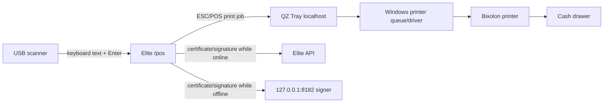

# Elite POS Hardware Integration Runbook

> **Purpose:** Provision and certify one physical Elite register using a Posiflex-class Windows terminal, QZ Tray, a Bixolon 80 mm ESC/POS printer, a printer-connected cash drawer, and a USB HID barcode scanner.  
> **Related:** Read [Elite POS System and Integration Guide](./12-pos-system.md) before using this runbook. For an interactive, checkbox-driven version of this same sequence to use on-site, see the [POS Field Setup Runbook](./pos-field-setup-runbook.html). For the technical postmortem of the two real QZ-signing bugs found and fixed during the first hardware test pass (server-side hash-vs-JSON mismatch, client-side `AsyncFunction` detection breaking under Angular's production build), see [15-pos-production-hardening-plan.md](./15-pos-production-hardening-plan.md)'s Phase 3 exit gate.

## 1. Supported Hardware Model

| Component | Expected integration |
|---|---|
| POS terminal | Windows terminal or PC running a supported Chromium browser |
| Receipt printer | Bixolon 80 mm ESC/POS printer installed as an OS printer queue |
| Cash drawer | Connected to the receipt printer's drawer kick port; never directly controlled by Elite |
| Barcode scanner | USB HID/keyboard-wedge scanner configured to append Enter |
| Print bridge | QZ Tray 2.2.x running locally |
| Offline signing | Elite POS device signer running on `127.0.0.1:8182` |

Do not assume two models with similar names have identical cutter, QR, code page, or drawer behavior. Certify the exact model and firmware used in production.

## 2. Data and Command Path


```mermaid
flowchart LR
    UI["Elite /pos"] -->|"ESC/POS print job"| QZ["QZ Tray localhost"]
    UI -->|"certificate/signature while online"| API["Elite API"]
    UI -->|"certificate/signature while offline"| SIGNER["127.0.0.1:8182 signer"]
    QZ --> DRIVER["Windows printer queue/driver"]
    DRIVER --> PRINTER["Bixolon printer"]
    PRINTER --> DRAWER["Cash drawer"]
    SCANNER["USB scanner"] -->|"keyboard text + Enter"| UI
```

Elite does not send directly to printer port `9100` and does not use browser WebUSB. QZ Tray owns printer communication.

## 3. Network and Port Requirements

| Source | Destination | Port/protocol | Reason |
|---|---|---|---|
| Browser | Elite admin/API | `443/TCP` HTTPS | UI, session, API, SSE, online QZ signatures |
| Browser | QZ Tray | QZ secure localhost WebSocket, normally `8181` | Discover printers and submit jobs |
| Browser | Device signer | `127.0.0.1:8182/TCP` HTTP | Offline certificate and signature callbacks |
| QZ/Windows | Printer | USB, Windows spooler, or printer-specific network path | Physical print delivery |

Requirements:

- The device signer must bind only to `127.0.0.1`, not `0.0.0.0` or a LAN address.
- No inbound LAN firewall rule is required for port `8182`.
- Allow the Elite admin origin through Chrome Local Network Access prompts/policy.
- Permit long-lived HTTPS connections to `/api/pos/events`.
- If a network printer is used, reserve its IP and restrict printer access to the POS VLAN.

## 4. Required Files and Secrets

Prepare:

- QZ signing `digital-certificate.txt`.
- Matching RSA 2048-bit PKCS#8 private key.
- A server-side certificate/key available to the Elite API.
- A separate per-register certificate/key available only to that register's local signer.
- The exact printer queue name as returned by QZ Tray.
- The exact production Elite admin origin.

Obtain signing material through the approved QZ certificate process. Do not invent an unrelated browser certificate or reuse the Elite HTTPS certificate.

Private keys must never be:

- Added to Git.
- Bundled in Angular.
- Stored in IndexedDB/localStorage.
- Returned by an API endpoint.
- Shared over a common network folder.
- Reused across every physical register when per-register revocation is required.

## 5. Configure the Elite API Signer

Place the public certificate and private key in the deployment secret store or restricted filesystem. Configure `server/.env`:

```dotenv
QZ_SIGNING_CERT_PATH=/run/secrets/qz/digital-certificate.txt
QZ_SIGNING_KEY_PATH=/run/secrets/qz/private-key.pem
POS_PRINTER_ALLOWLIST=BIXOLON SRP-350plusIII
```

For multiple approved queues, use comma-separated exact names:

```dotenv
POS_PRINTER_ALLOWLIST=BIXOLON SRP-350plusIII,BIXOLON SRP-350plusIII Counter 2
```

Restart the API and verify:

- An authenticated, enrolled POS session can call `GET /api/pos/print/certificate`.
- `POST /api/pos/print/sign` signs approved QZ operations.
- A print request naming a non-allowlisted printer is rejected.
- Unsupported operations such as file writes are rejected.

The signer limits request size, allows only QZ WebSocket/version/printer discovery/print calls, checks printer names, rate-limits each register, and audits signed drawer commands.

## 6. Install and Configure the Printer

### 6.1 Physical connection

1. Connect the Bixolon printer to the register PC via USB (or the deployment-approved network/serial interface, if not USB).
2. Power on the printer and load an approved thermal paper roll. Set the correct paper width for the exact model in use — do not assume every "80mm-class" printer shares the same printable width or DPI; confirm from the model's own spec sheet (the SRP-QE300 specifically is 180dpi with a 72mm printable area on 80mm media, not the full 80mm — this is what the receipt renderer's canvas width is tuned for; a different model needs its own width recomputed, see the "Receipt prints unreadable symbols, or the right edge of every line is cut off" troubleshooting entry below).
3. Windows should detect the printer and either auto-install a driver or prompt for one. If auto-detection fails, install the Bixolon-provided Windows driver package for the exact model from Bixolon's official downloads page.

### 6.2 Windows printer queue

1. Open **Settings → Devices → Printers & scanners** (or **Control Panel → Devices and Printers**).
2. Create a stable printer queue name — avoid names Windows may auto-rename after a USB port change. Confirm the exact name character-for-character; write it down.
3. Set the correct paper width in the driver's printer properties (see 6.1.2).
4. Disable driver transformations that convert raw ESC/POS to a graphic document, if the driver offers a raw/pass-through mode — Elite's receipt body is already a rasterized image (see the print pipeline notes above), so double-transformation by the driver can corrupt output.
5. Print the Windows test page only to verify transport (cable/driver connectivity); it does not validate ESC/POS or QZ Tray's signing path — that's confirmed separately in §13.
6. Record printer model, serial number, firmware, connection type, queue name, and assigned register.

### 6.3 Confirm QZ Tray sees it

1. With QZ Tray running (§9) and its certificate trusted (§9.1), open Elite's Settings/Hardware dialog and use its "Find printers" action — the exact queue name from step 6.2.2 should appear.
2. If it doesn't appear: restart the Windows print spooler (`services.msc` → "Print Spooler" → Restart), then restart QZ Tray fully (exit via its tray icon, then relaunch).

The queue name entered in Elite's Hardware dialog must exactly match the Windows queue name from step 6.2.2. There is no separate server-side printer allowlist to keep in sync with it — printer scoping is enforced by register enrollment/authentication, not by inspecting the printer name in the signing request (see §9.1 and the "QZ shows an unsigned/untrusted warning" troubleshooting entry for why).

## 7. Connect the Cash Drawer

1. Power off the printer.
2. Connect the drawer cable to the printer's drawer kick port.
3. Confirm the cable pinout and voltage are approved by both printer and drawer vendors.
4. Power on the printer.
5. Start with **Pin 2** in Elite hardware settings.
6. If the drawer does not open and the hardware manual specifies the alternate output, test **Pin 5**.
7. Choose **Disabled** if no drawer is attached.

Elite sends an ESC/POS `ESC p` pulse only for cash receipt printing. Card receipt printing must not pulse the drawer. A manual open should be treated as a controlled manager action; the current UI primarily opens the drawer through cash checkout.

Never connect the drawer directly to a general computer port or improvise voltage/pin mappings.

> **Note:** the drawer-kick pulse pin (`epson-pin-2` vs `epson-pin-5`) is configured per-register in Elite's Settings/Hardware screen. Confirm which pin your specific drawer cable uses before configuring — the wrong pin silently does nothing (no error is shown), so a drawer that "doesn't open" is often just the wrong pin selected, not a hardware fault.

## 8. Configure the Barcode Scanner

1. Connect the scanner by USB.
2. Configure it as HID keyboard/keyboard wedge.
3. Set the scanner suffix to Enter/Carriage Return.
4. Select a keyboard layout that matches the Windows user session.
5. Disable scanner-added prefixes unless Elite product barcodes include them.
6. Ensure Elite `product_variants.barcode` values exactly match the scanned data.
7. In `/pos`, focus the barcode field, scan, and verify one exact variant is added.
8. Test an unknown barcode and confirm the cart does not change.
9. Test rapid repeated scans and quantity limits against available stock.

The implemented UI uses the barcode input and Enter submission. There is no camera scanner in the current baseline.

## 9. Install QZ Tray

1. Install the approved QZ Tray 2.2.x build for all terminal users.
2. Configure QZ Tray to start when Windows starts.
3. Confirm it is listening on its secure localhost WebSocket.
4. Open QZ Tray and verify the Bixolon queue appears with the exact expected name.
5. **Trust the signing certificate permanently via `authcert.override`** — see the exact tested procedure below. This is the step that prevents QZ Tray's "Action Required — Allow/Block" dialog from appearing on every single print.
6. Open Elite in the production Chrome/Edge profile and accept required localhost/local-network permissions.
7. Confirm signed printer discovery and printing do not show an unsigned-job warning.

Do not approve a workflow that relies on an operator clicking through QZ unsigned warnings on every print. Production commands must be signed, and the certificate must be pre-trusted per step 5 so the dialog never appears during normal operation.

### 9.1 Trusting the certificate with `authcert.override` (tested procedure)

This makes QZ Tray permanently trust Elite's signing certificate on this specific Windows machine, so printing is silent — no per-print confirmation dialog. Confirmed working on a real POSIFLEX/Bixolon SRP-QE300 register on 2026-07-19.

1. **Download the public certificate.** While logged into Elite in the browser on this register (so the session cookie is present), navigate to:
   ```
   https://admin.<your-domain>/api/pos/print/certificate
   ```
   This returns plain certificate text (starts with `-----BEGIN CERTIFICATE-----`). Save it via the browser's Save/Ctrl+S as a plain text file.

   (A raw PowerShell `Invoke-WebRequest` to this URL will fail with "Authentication required" since it has no session cookie — using the logged-in browser tab is the simplest path. Also run `[Net.ServicePointManager]::SecurityProtocol = [Net.SecurityProtocolType]::Tls12` first in PowerShell if you do script it, since Windows 10 LTSB-class machines often default to an older TLS version that the server rejects.)

2. **Place it at a stable path.** Move/save the downloaded file to:
   ```
   C:\ProgramData\ElitePOS\qz\digital-certificate.txt
   ```
   Create the folder first if needed (PowerShell): `New-Item -ItemType Directory -Path "C:\ProgramData\ElitePOS\qz" -Force`

3. **Find QZ Tray's properties file**, typically:
   ```
   C:\Program Files\QZ Tray\qz-tray.properties
   ```
   (Search with `Get-ChildItem -Path "C:\Program Files","C:\ProgramData","$env:LOCALAPPDATA" -Recurse -Filter "qz-tray.properties"` if the install location differs.)

4. **Add the override line**, matching the file's existing escaping style (`:` → `\:`, `\` → `\\`). Requires an **elevated/Administrator** PowerShell or text editor, since the file lives under `Program Files`:
   ```
   authcert.override=C\:\\ProgramData\\ElitePOS\\qz\\digital-certificate.txt
   ```
   Example full file after the addition:
   ```properties
   #Sat Jul 11 15:08:56 AST 2026
   ca.storepass=<redacted>
   wss.host=0.0.0.0
   wss.storepass=<redacted>
   wss.alias=qz-tray
   ca.alias=root-ca
   ca.keystore=C\:\\ProgramData\\qz\\ssl\\root-ca.p12
   wss.keystore=C\:\\ProgramData\\qz\\ssl\\qz-tray.p12
   authcert.override=C\:\\ProgramData\\ElitePOS\\qz\\digital-certificate.txt
   ```

5. **Restart QZ Tray fully** — right-click its system tray icon → **Exit** (not just closing a window), then relaunch it.

6. **Verify**: reload `/pos` in the browser, ring up a test sale, and print. No "Action Required" dialog should appear, and DevTools console should show `[pos-hardware] printReceipt — done` with no `FAILED` entries.

**Record for this register:** certificate fingerprint and validity window (visible via QZ's own "View request details" panel on the Allow/Block dialog, before you've set the override — or via `openssl x509 -in digital-certificate.txt -noout -fingerprint -dates`). At time of writing for the pilot register: fingerprint `403bcfc4-4d49f23c...` (truncated), valid `2026-07-11` through `2031-07-10`. **Set a calendar reminder well before the expiry date** — printing will silently start failing once the certificate lapses, and every register using `authcert.override` will need the same re-trust procedure with the newly rotated certificate.

## 10. Provision the Offline Device Signer

The signer source is in `tools/pos-device-signer` and requires Node.js 20 or newer. It exposes:

- `GET /health`
- `GET /qz/certificate`
- `POST /qz/sign`

It validates browser origin and request size, then signs locally. It never returns the private key. It cannot enforce a printer/call-type allowlist — QZ Tray's client only sends a hash of the call, never the printer name it hashed — so printer scoping happens earlier, at the API's own authenticated/enrolled-register checks.

### Environment

```dotenv
ELITE_POS_QZ_CERT_PATH=C:\ProgramData\ElitePOS\qz\digital-certificate.txt
ELITE_POS_QZ_KEY_PATH=C:\ProgramData\ElitePOS\qz\private-key.pem
ELITE_POS_ALLOWED_ORIGINS=https://admin.example.com
ELITE_POS_SIGNER_PORT=8182
```

For local development, include the exact development origin only when needed:

```dotenv
ELITE_POS_ALLOWED_ORIGINS=http://localhost:4300
```

### Manual verification

From `tools/pos-device-signer` with the environment loaded:

```bash
npm start
```

Then verify from the same machine:

```bash
curl http://127.0.0.1:8182/health
```

Expected response:

```text
ok
```

### Windows startup

Install the signer as a restricted automatic startup service using the organization's approved service wrapper or Windows service tooling:

- Run as a dedicated, non-administrator local account.
- Grant that account read access only to its certificate and private key.
- Set the working directory to `tools/pos-device-signer` or the deployed signer directory.
- Load environment values from a protected service configuration, not a shared user profile.
- Configure automatic restart after failure.
- Capture stdout/stderr in a protected rotating log.
- Start after networking, but do not expose a LAN listener.

After setup, restart Windows and confirm `/health` returns `ok` without anyone opening a terminal window.

## 11. Enroll the Physical Register

1. Use the dedicated production browser profile.
2. Sign in to Elite as an owner/admin.
3. Open `/pos`.
4. Enter a stable register name such as `Main Counter 1`.
5. Select **Connect register**.
6. Record the displayed register name and its server-side register ID in the asset register.
7. Open a test shift with the approved opening float.

The raw register credential is returned once and stored in IndexedDB. Do not clear the browser profile after enrollment. If the profile is lost, revoke/disable the old register and enroll a new identity.

## 12. Configure Hardware in Elite

From the selling screen:

1. Open **Hardware**.
2. Enter the exact QZ printer queue name.
3. Enter `http://127.0.0.1:8182` as the device signer URL.
4. Select drawer Pin 2, Pin 5, or Disabled.
5. Save.
6. Confirm the hardware indicator reports a successful QZ connection.

These settings are local to the browser profile and stored in IndexedDB. Recheck them after browser-profile migration, Windows reimaging, or printer queue changes.

## 13. Required Acceptance Tests

Do not release the register until every applicable test passes.

### A. Online cash sale

1. Keep Elite connected.
2. Add a low-value test product.
3. Complete a cash sale with tender greater than total.
4. Confirm the sale is saved before evaluating print output.
5. Confirm receipt prints once.
6. Confirm drawer opens once.
7. Confirm tendered and change amounts are correct.
8. Confirm cashier, full 36-character register ID, SKU, totals, and lookup QR are present. The current renderer truncation must be fixed before this test can pass.
9. Scan the QR and confirm Elite finds the transaction.

### B. Online card sale

1. Complete the external/manual card test first.
2. Confirm Card in Elite.
3. Confirm receipt prints.
4. Confirm drawer does not open.

### C. Refund receipt

1. Look up the sale using its QR or receipt number.
2. Complete a partial refund with manager PIN.
3. Confirm the refund receipt lists refunded items/SKUs and reason.
4. Scan the refund QR and confirm it resolves to the original sale/refund history.
5. Confirm selected inventory is restored only when Restock is enabled.

### D. Printer failure safety

1. Disconnect or pause the printer.
2. Complete a sale.
3. Confirm Elite saves the sale and reports only the print failure.
4. Restore printer connectivity.
5. Reprint without creating another transaction or opening the drawer unexpectedly.

### E. Offline sale and print

1. Confirm the register has an open shift, cached catalog, and unused receipt numbers.
2. Physically disconnect Elite/network access; do not merely hide a UI indicator.
3. Complete a sale.
4. Confirm it receives a reserved receipt number and appears in Queue.
5. Confirm QZ obtains its signature from the local signer and prints without a warning dialog.
6. For cash, confirm the drawer opens.
7. Restart the browser and confirm the queued sale remains.
8. Restore connectivity and confirm Queue returns to zero exactly once.
9. Search the receipt in Elite and confirm one transaction/order/payment exists.

### F. Restart recovery

1. Restart Windows.
2. Confirm QZ Tray starts automatically.
3. Confirm the device signer health endpoint is available.
4. Open the production browser profile and `/pos`.
5. Confirm register identity, current shift, catalog cache, receipt block, and hardware settings remain available.
6. Print an online test receipt.

### G. Scanner

1. Scan a known barcode ten times at normal operator speed.
2. Confirm each scan resolves the expected variant.
3. Scan an unknown code and verify no cart mutation.
4. Test after Windows restart and keyboard-layout changes.

## 14. Troubleshooting

### QZ does not connect

- Confirm QZ Tray is running in the logged-in Windows session.
- Confirm the browser can reach the secure QZ localhost WebSocket.
- Check Chrome Local Network Access permission for the Elite origin.
- Confirm endpoint security software is not blocking localhost WebSockets.
- Restart QZ Tray, then reload `/pos`.

### Printer is not listed

- Confirm Windows sees the printer queue.
- Print a Windows test page.
- Compare the queue name character-for-character.
- Check whether Windows renamed the queue after a USB port change.
- Restart the spooler and QZ Tray after driver installation.

### Printer configuration disappears (asks to re-enter the printer name again)

- This is not a QZ or printer problem — it's the browser's **site data being cleared for the Elite origin**. The printer name, drawer/signer settings, register enrollment, and the offline sale queue all live in IndexedDB on that browser profile (`pos-local-store.service.ts`), scoped to that origin. Chrome/Edge's "Clear cookies" / "Clear browsing data" with **"Cookies and other site data"** checked wipes IndexedDB too, not just cookies, despite the label — this is the confirmed cause seen in production.
- Fix at the browser level, not per-incident: on any register/kiosk machine, either (a) never run "clear cookies" against that browser profile, or (b) add the Elite admin origin as an exception in the browser's site-data settings (`chrome://settings/content/all` → find the origin → exclude it from clearing). If the machine's kiosk-lockdown policy wipes browser data automatically on every restart, that's incompatible with this app's local persistence entirely — including the offline sale queue, which is the more serious risk (a wipe mid-shift with unsynced offline sales would lose them). Confirm this isn't happening on a schedule.
- After a wipe, re-setup is faster than before: opening the Hardware dialog on the POS with no printer configured now auto-runs QZ printer discovery and pre-fills the name if exactly one printer is found (or lists all found printers in a picker if there's more than one) — see `pos.component.ts`'s `discoverPrinters()`. You should not need to type the exact QZ printer name from memory.

### QZ shows an unsigned/untrusted warning, or an "Action Required — Allow/Block" dialog on every print

- If the dialog's **Signature** field (via "View request details") shows anything other than **Valid**, stop production use until corrected — that's a genuine signing failure, not just a trust prompt. Confirm certificate and private key match, and that the API or local signer is reachable.
- If the signature IS valid but the dialog still appears on every print, this is expected until the certificate is marked trusted — see §9.1 for the tested `authcert.override` procedure. This is a one-time-per-register step, not a bug.
- If the on-screen Allow/Block dialog doesn't respond to clicks over a remote-desktop/remote-access session (button appears greyed out or unresponsive after checking "Remember this decision"), try the keyboard shortcut (`Alt+A` for Allow) or close any "View request details" popup layered on top first; native Windows security dialogs are known to have flaky mouse-click forwarding over some remote sessions. If nothing works remotely, this needs one physical click at the register — after that it's remembered permanently (or use `authcert.override` to skip the dialog entirely, recommended for unattended registers).
- Confirm the admin origin exactly matches the local signer's allowlist.
- Check certificate validity/renewal dates (see §9.1 for where to find them).

### Online printing works but offline printing fails

- Check `http://127.0.0.1:8182/health`.
- Confirm the signer service starts automatically.
- Confirm its key paths and service-account permissions.
- Confirm `ELITE_POS_ALLOWED_ORIGINS` matches the browser origin exactly.
- Inspect signer logs for denied operations or malformed requests.

### Receipt prints unreadable symbols, or the right edge of every line is cut off

- The receipt body is rendered as a rasterized image (canvas → PNG → QZ's `format: 'image'`, `language: 'escpos'` path), not raw ESC/POS text — this is what makes Arabic text render correctly, since raw ESC/POS text mode cannot shape or reorder Arabic at all. If text looks garbled, the issue is in the canvas rendering or image-print path, not a printer code page setting.
- If lines are cut off on the right side of the physical paper: the renderer's canvas width (`pos-receipt-renderer.service.ts`'s `widthPx`) must match the printer's actual **printable** width, not its paper/media width — these differ. For the SRP-QE300: 80mm media, but only 72mm is printable, at 180dpi → **510px**, not the 576px you'd get assuming a full 80mm at 203dpi. If a different printer model is used, confirm its printable width and DPI from its own spec sheet and recompute `widthPx` accordingly; do not assume all "80mm thermal printers" share the same DPI or printable width.
- Elite's receipts are bilingual (Arabic + English) by design — see `pos_business_profile` in Settings → General for the legal trade name/address/phone fields printed on every receipt. If a printed receipt shows English only, that's very likely because `pos_business_profile` hasn't been filled in yet for this tenant, not a rendering bug — check the Settings screen first.

### QR does not scan

- Clean the print head and use approved thermal paper.
- Confirm 80 mm paper width and scaling.
- Verify QR module size and darkness on the exact firmware.
- Ensure the receipt is not folded through the QR.
- Use the printed receipt number as the fallback lookup.

### Drawer does not open

- Confirm the drawer is connected to the printer, not the terminal.
- Confirm cable pinout/voltage compatibility.
- Test Pin 2 and Pin 5 only as allowed by the manuals.
- Confirm the sale is Cash; card receipts intentionally do not pulse.
- Check that the printer completed the job and is not paused.

### Drawer opens on card sale

- Stop use and verify the selected transaction method.
- Confirm no driver/vendor utility automatically pulses the drawer on every print.
- Disable automatic drawer behavior in the printer driver.
- Re-run online and offline card tests.

### Scanner types but does not add an item

- Focus the POS barcode field.
- Confirm the scanner appends Enter.
- Compare scanned output with `product_variants.barcode` including leading zeros.
- Remove unexpected prefixes/suffixes.
- Verify keyboard layout and NumLock behavior.

## 15. Security and Maintenance

### Certificate rotation

1. Provision the replacement certificate/key before expiry.
2. Update API and per-register signer secrets through the approved secret channel.
3. Restart services.
4. **If any register uses `authcert.override` (§9.1), replace the `.txt` file at its configured path with the new certificate on every such register** — the override is pinned to that specific certificate file's contents, and printing will fail once the old certificate expires unless this file is updated first.
5. Verify online and offline signed print jobs.
6. Revoke the old material after all terminals pass.
7. Record rotation date, owner, and next expiry.

### Register decommissioning

1. Close its active shift and synchronize all queued sales.
2. Disable/revoke the server-side register.
3. Remove the local signer service.
4. Securely remove the per-register private key.
5. Remove QZ trust material if the terminal is leaving service.
6. Clear the dedicated browser profile only after confirming no queued business data remains.
7. Update the hardware asset register.

### Patch management

After updates to Windows, Chrome/Edge, QZ Tray, printer drivers, or firmware, rerun:

- Online cash and card print tests.
- Offline signed print test.
- Drawer pin tests.
- Scanner test.
- Restart recovery test.
- Chrome Local Network Access verification.

## 15.5 New Register / New Branch Setup Checklist

Use this as the single top-to-bottom sequence when standing up a brand-new physical register — whether it's an additional till in the existing shop or the first register at a new branch location. Each step links back to its detailed section above.

- [ ] **Confirm hardware model** matches §1 (register, printer, drawer, scanner) — do not assume a similar-looking model behaves identically; verify the exact printer model and firmware.
- [ ] **Network/port access** per §3 — HTTPS to the Elite domain, QZ Tray's local WebSocket, `127.0.0.1:8182` for the offline signer. No inbound LAN rule needed for the signer.
- [ ] **Windows account setup**: dedicated, non-administrator local account for POS use per the hardening plan's kiosk-hardening guidance (docs/15).
- [ ] **Set Windows display to the screen's actual native resolution** — do not assume a higher resolution "looks fine." A POSIFLEX KS-7412 register's 12" panel is native 1024×768; running it at a higher resolution shrinks and blurs everything and produces a UI that feels too small for the touch screen. Confirm in Display Settings.
- [ ] **Install and connect the printer** per §6 (physical connection → Windows queue → OS test page → confirm exact queue name).
- [ ] **Connect the cash drawer** per §7, confirm the correct kick-pin.
- [ ] **Configure the barcode scanner** per §8 (HID/keyboard-wedge, Enter-terminated).
- [ ] **Install QZ Tray** per §9, confirm it starts with Windows and connects to its local WebSocket.
- [ ] **Trust the signing certificate** per §9.1 (`authcert.override`) — this is required per-register; the certificate override is a local file path on each machine, it does not carry over from a previous register's setup.
- [ ] **Provision the offline device signer** per §10 if this register needs to support genuinely offline printing (not just online-with-occasional-network-blips) — set its own `ELITE_POS_ALLOWED_ORIGINS`, cert/key paths, and confirm `/health` responds after a fresh Windows restart.
- [ ] **Enroll the physical register** in Elite per §11: sign in as owner/admin on this register's dedicated browser profile, generate a one-time enrollment token from Settings, and complete enrollment. Each register gets its own identity — do not reuse one register's enrollment token or credential on a second machine.
- [ ] **Configure hardware in Elite** per §12: enter the *exact* printer queue name from step 6.2.2, select the correct drawer pulse pin, set the offline signer URL if applicable.
- [ ] **If this is a NEW BRANCH (not just a new till in the existing shop)**: stop here and confirm with the team before proceeding. True multi-location support (separate per-branch stock, location-scoped reporting) is not yet built — see [16-launch-roadmap.md](./16-launch-roadmap.md)'s Phase 11. Today, all registers across all physical locations would share one tenant-wide stock count, which is incorrect for a genuinely separate branch with its own inventory. Do not enroll a second-branch register into production until that data-model work is scoped and built, or stock levels across both locations WILL be wrong.
- [ ] **Run the full acceptance test suite** per §13 (online cash sale, online card sale, refund receipt, printer failure safety, offline sale, restart recovery, scanner) before handing the register to staff.
- [ ] **Confirm `pos_business_profile` is filled in** at Settings → General → Receipt & Legal Profile — this is tenant-wide, not per-register, so it only needs doing once, but confirm it's actually filled in for this tenant. A blank profile silently falls back to English-only defaults with no legal content.
- [ ] **Complete the per-register acceptance record** per §16 and file it.

## 16. Per-Register Acceptance Record

Copy this section into the deployment ticket for each physical register:

```text
Store/Tenant:
Register display name:
Elite register ID:
Terminal asset/serial:
Windows version:
Browser/version/profile:
QZ Tray version:
Printer model/serial/firmware:
Printer queue name:
Connection type:
Drawer model/cable/pin:
Scanner model/serial:
Local signer service account:
Signer certificate expiry:

Online cash test: PASS / FAIL
Online card/no-drawer test: PASS / FAIL
Refund receipt and QR test: PASS / FAIL
Printer failure/reprint test: PASS / FAIL
Physical offline print/sync test: PASS / FAIL
Windows restart recovery test: PASS / FAIL
Scanner test: PASS / FAIL

Tested by:
Date/time:
Notes/incidents:
Approved for production by:
```
